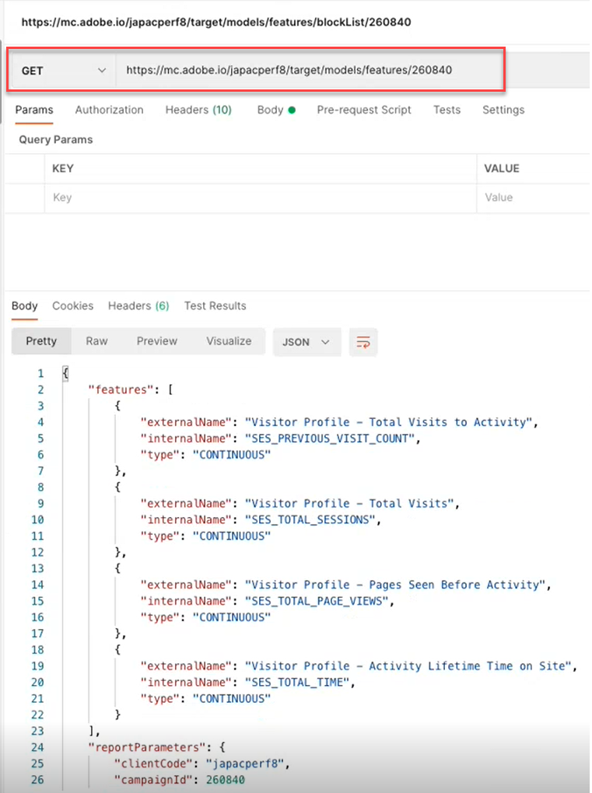
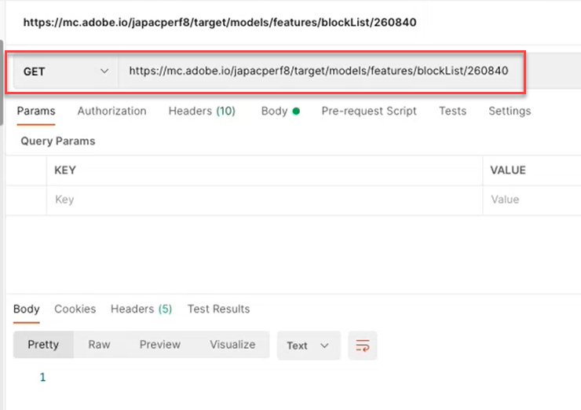
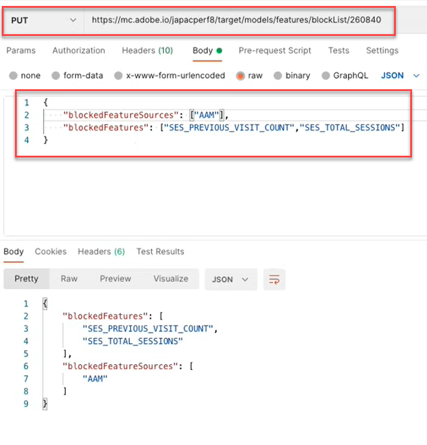
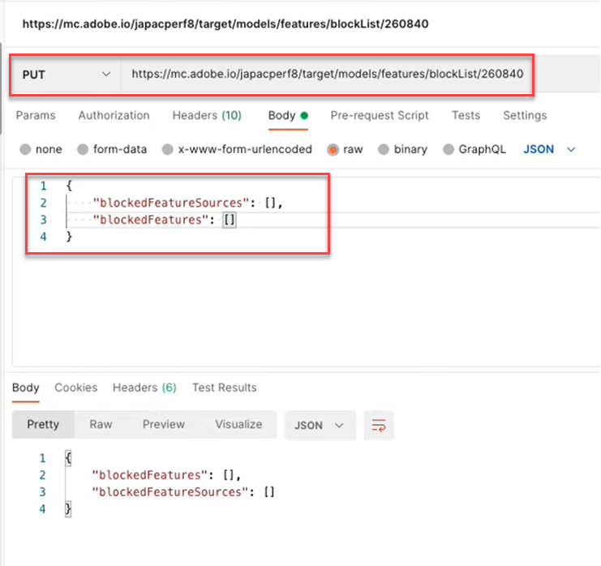
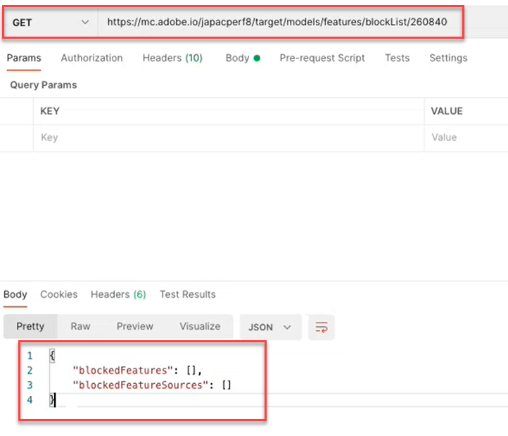
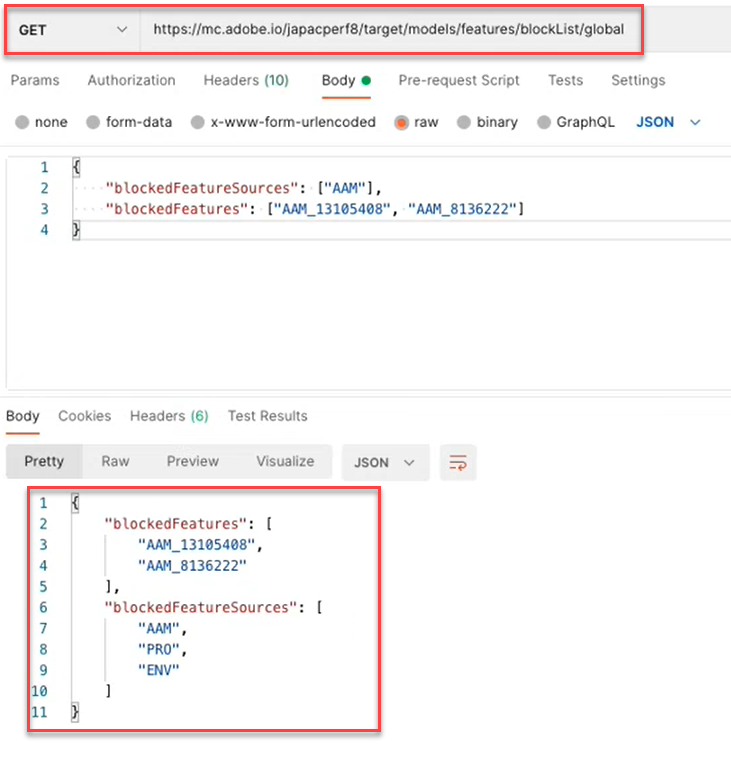

# Models API Overview

The Models API, also called the Blocklist API, enables users to view and manage the list of features used in machine learning models for Automated Personalization (AP) and Auto-Target (AT) activities. If a user would like to exclude a feature from being used by the models for AP or AT activities, they can use the Models API to add that feature to the "blocklist."

<InlineAlert variant="info" slots="header, text"/>

Definition

A **blocklist** defines the set of features that will be excluded by Adobe Target from its machine learning models. For more information on features, see [Data used by Target machine-learning algorithms](https://experienceleague.adobe.com/docs/target/using/activities/automated-personalization/ap-data.html).

Blocklists may be defined per activity (activity level), or for all activities within a Target account (global level).

<!-- To get started with the Models API in order to create and manage your blocklist, download the Postman Collection [here](https://git.corp.adobe.com/target/ml-configuration-management-service/tree/nextRelease/rest_api_library). Note this is an Adobe internal link. Need to publish this publicly if want to share with customers. -->

## Models API specification

View the Models API specification [here](../administer/models-api/index.md).

## Prerequisites

To use the Models API, you must configure authentication using the [Adobe Developer Console](https://developer.adobe.com/console/home), just as you would with the [Target Admin API](../administer/admin-api/index.md). For more information, see [How to Configure Authentication](../before-administer/configure-authentication.md).

## Models API usage guidelines

<InlineAlert variant="info" slots="header, text1, text2, text3, text4, text5"/>

How to manage blocklists

[**Step 1:**](#step1) View list of features for an activity

[**Step 2:**](#step2) Check the blocklist of the activity

[**Step 3:**](#step3) Add features to the blocklist of the activity

[**Step 4:**](#step4) (Optional) Unblock

[**Step 5:**](#step5) (Optional) Manage the global blocklist


## Step 1: View list of features for an activity {#step1}

Before blocklisting a feature, view the list of features that are currently being included in the models for that activity.

<CodeBlock slots="heading, code" repeat="2" languages="JSON, JSON" />

#### Request

```json
GET https://mc.adobe.io/<tenant>/target/models/features/<campaignId>
```

#### Response

```json
{
    "features": [
        {
            "externalName": "Visitor Profile - Total Visits to Activity",
            "internalName": "SES_PREVIOUS_VISIT_COUNT",
            "type": "CONTINUOUS"
        },
        {
            "externalName": "Visitor Profile - Total Visits",
            "internalName": "SES_TOTAL_SESSIONS",
            "type": "CONTINUOUS"
        },
        {
            "externalName": "Visitor Profile - Pages Seen Before Activity",
            "internalName": "SES_PREVIOUS_VISIT_COUNT",
            "type": "CONTINUOUS"
        },
        {
            "externalName": "Visitor Profile - Activity Lifetime Time on Site",
            "internalName": "SES_TOTAL_TIME",
            "type": "CONTINUOUS"
        }
    ],
    "reportParameters": {
        "clientCode": <tenant>,
        "campaignId": <campaignId>
    }
}
```

<!-- JUDY: Update codeblock above once you have the complete Response. -->

In the example shown here, the user is checking to see the list of features being used in the model for the activity whose Activity ID is 260840.



<InlineAlert variant="info" slots="text"/>

To find your activity's Activity ID, navigate to the Activities List in the Target UI. Click on the activity of interest. The Activity ID will be displayed in the body of the resulting Activities Overview page, as well as at the end of the URL for that page.

<InlineAlert variant="info" slots="header, text1, text2"/>

Definition

The **externalName** is a user-friendly name for a feature. It is created by Target, and it is possible this value may change over time. Users can view these user-friendly names in the [Personalization Insights report](https://experienceleague.adobe.com/docs/target/using/reports/insights/personalization-insights-reports.html).

The **internalName** is the feature's actual identifier. It is also created by Target, but it cannot be changed. This is the value you will need to reference in order to identify the feature(s) you would like to blocklist.

Note that in order for the features list to populate with values (that is, in order for it to be non-null), an activity:

1. Must have Status = Live, or must have been activated previously
2. Must have been running long enough for there to be campaign activity, so that the model has had data to run against.

## Step 2: Check the blocklist of the activity {#step2}

Next, view the blocklist. In other words, check to see which features, if any, are currently being blocked from inclusion in the models for this activity.

<InlineAlert variant="error" slots="text"/>

Note that `/blockList/` is case sensitive in the request.

<CodeBlock slots="heading, code" repeat="2" languages="JSON, JSON" />

#### Request

```json
GET https://mc.adobe.io/<tenant>/target/models/features/blockList/<campaignId>
```

#### Response

````json

````

In the example shown here, the user is checking the list of blocked features for the activity whose Activity ID is 260840. The results are empty, which means this activity does not currently have any blocklisted features.



<InlineAlert variant="info" slots="text"/>

You may see empty results like this, the first time you check the full blocklist, before adding any features to it. However, once you have added (and subsequently removed) features from a blocklist, you may see slightly different results, in which an empty blocklisted features array is returned. Continue reading to see an example of this in [Step 4](#step4).

## Step 3: Add features to the blocklist of the activity {#step3}

To add features to the blocklist, change the request from GET to PUT, and modify the body of the request to specify the `blockedFeatureSources` or `blockedFeatures` as desired.

* The body of the request requires either `blockedFeatures` or `blockedFeatureSources`. Both may be included.
* Populate `blockedFeatures` with values identified from `internalName`. See [Step 1](#step1).
* Populate `blockedFeatureSources` with values from the table below.

Note that `blockedFeatureSources` indicates where a feature came from. For the purposes of blocklisting, they serve as groups or categories of features, which enable users to block entire sets of features at once. The values of `blockedFeatureSources` match the first characters of a feature's identifier (`blockedFeatures` or `internalName` values); therefore they may also be considered "feature prefixes."

### Table of `blockedFeatureSources` values {#table}

|Prefix|Description|
| --- | --- |
|BOX|Mbox parameter|
|URL|Custom - URL Parameter|
|ENV|Environment|
|SES|Visitor Profile|
|GEO|Geo location|
|PRO|Custom - Profile|
|SEG|Custom - Reporting Segment|
|AAM|Custom - Experience Cloud Segment|
|MOB|Mobile|
|CRS|Custom - Customer Attributes|
|UPA|Custom - RT-CDP Profile Attribute|
|IAC|Visitor Interest Areas||

<CodeBlock slots="heading, code" repeat="2" languages="JSON, JSON" />

#### Request

```json
PUT https://mc.adobe.io/<tenant>/target/models/features/blockList/<campaignId>

{
    "blockedFeatureSources": ["AAM"],
    "blockedFeatures": ["SES_PREVIOUS_VISIT_COUNT", "SES_TOTAL_SESSIONS"]
}
```

#### Response

````json
{
    "blockedFeatures": [
            "SES_PREVIOUS_VISIT_COUNT",
            "SES_TOTAL_SESSIONS"
        ],
    "blockedFeatureSources": [
            "AAM"
        ]
}

````

In the example shown here, the user is blocking two features, `SES_PREVIOUS_VISIT_COUNT` and `SES_TOTAL_SESSIONS`, which they previously identified by querying the full list of features for the activity whose Activity ID is 260480, as described in [Step 1](#step1). They are also blocking all features coming from Experience Cloud Segments, which is achieved by blocking features with the prefix of "AAM," as described in the [table](#table) above.



<InlineAlert variant="help" slots="text" />

Note that after blocklisting a feature, it is recommended that you verify the updated blocklist by performing [Step 2](#step2) again (GET the blocklist). Verify that the results appear as expected (verify that the results include the features added from the latest PUT request).

## Step 4: (Optional) Unblock {#step4}

To unblock all blocklisted features, clear the values from `blockedFeatureSources` or `blockedFeatures`.

<CodeBlock slots="heading, code" repeat="2" languages="JSON, JSON" />

#### Request

```json
PUT https://mc.adobe.io/<tenant>/target/models/features/blockList/<campaignId>

{
    "blockedFeatureSources": [],
    "blockedFeatures": []
}
```

#### Response

````json
{
    "blockedFeatures": [],
    "blockedFeatureSources": []
}

````

In the example shown here, the user is clearing their blocklist for the activity whose Activity ID is 260840. Note that the response confirms empty arrays for both blocked features and their sources—`blockedFeatureSources` and `blockedFeatures`, respectively.



As always, after modifying the blocklist, it is recommended that you perform [Step 2](#step2) again (GET the blocklist to verify the list includes features as expected). In the example shown here, the user is verifying that their blocklist is now empty.



<InlineAlert variant="info" slots="header, text"/>

Question: How can I delete some, but not all, of a blocklist?

Answer: To remove a discrete subset of blocklisted features from a multi-feature blocklist, users can simply send the updated list of features they would like to block in [the blocklist request](#step3), as opposed to clearing the entire blocklist and re-adding the desired features. In other words, send the updated feature list (as shown in [Step 3](#step3)), making sure to exclude the features you wish to "delete" from the blocklist.

## Step 5: (Optional) Manage the global blocklist {#step5}

The examples above were all in the context of a single activity. You may also block features for all activities across a given client (tenant), instead of having to specify the blocklist for each activity individually. To perform a global blocklist, use the `/blockList/global` call, instead of `blockList/<campaignId>`.

<CodeBlock slots="heading, code" repeat="2" languages="JSON, JSON" />

#### Request

```json
PUT https://mc.adobe.io/<tenant>/target/models/features/blockList/global

{
    "blockedFeatureSources": ["AAM", "PRO", "ENV"],
    "blockedFeatures": ["AAM_FEATURE_1", "AAM_FEATURE_2"]
}
```

#### Response

````json
{
    "blockedFeatures": [
        "AAM_FEATURE_1",
        "AAM_FEATURE_2"
    ],
    "blockedFeatureSources": [
        "AAM",
        "PRO",
        "ENV"
    ]
}

````

In the sample Request shown above, the user is blocking two features, "AAM_FEATURE_1" and "AAM_FEATURE_2," for all activities in their Target account. This means that, regardless of the activity, "AAM_FEATURE_1" and "AAM_FEATURE_2" will not be included in the machine learning models for this account. Furthermore, the user is also globally blocking all features whose prefix is "AAM," "PRO," or "ENV."

<InlineAlert variant="info" slots="header, text"/>

Question: Isn't the code sample above, redundant?

Answer: Yes. It is redundant to block features with values beginning with "AAM," while also blocking all features whose source is "AAM." The net result is that all features sourced from AAM (Experience Cloud Segments) will be blocked. Therefore, if the goal is to block all features from Experience Cloud Segments, individually specifying certain features beginning with "AAM" is unnecessary, in the example above.

Final step: Whether at the activity- or global-level, it is recommended that you verify your blocklist after modifying it, to ensure it contains the values you expect. Do this by changing the `PUT` to a `GET`.

The sample response shown below indicates Target is blocking two individual features, plus all features sourced from "AAM," "PRO," and "ENV."


