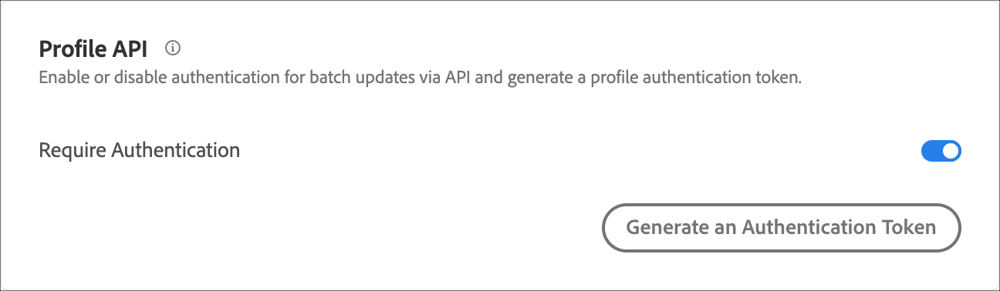

---
keywords:
- implementation
- api
- profile
- profile api settings
- authentication token
description: Learn how to configure authentication for batch updates via Adobe Target APIs and generate a profile authentication token.
title: How Do I Use Profile API Settings to Enable or Disable Batch Updates?
feature: APIs/SDKs
role: Developer
exl-id: 6346e11b-0853-47f1-9706-69e8635a6f25
---
# Profile API settings

Enable or disable authentication for batch updates via Adobe Target APIs and generate a profile authentication token.

Adobe Target creates and maintains a profile for every individual user. This profile is stored on the Target edge cluster and is updated in real time after every visit. You can also update a profile individually or in bulk via API.

For added security, you can require that the Bulk Update API call require a valid access token to be passed in the header of the request.

**To require authentication and to generate an access token using the Target UI:**

1. Click **Administration** > **Implementation**.
2. Under **Profile API** slide the **Require Authentication** toggle to the enabled or disabled position.

   

3. (Conditional) If you enabled authentication requirements, click **Generate New Profile Authentication Token**.

   

   The token expires according to the time listed in the Expires In box.

   You must have one of the following user permissions to generate an authentication token:

   * Admin role or have at least Approver rights

     For more information for Target Standard customers, see [Specify roles and Permissions](https://experienceleague.adobe.com/docs/target/using/administer/manage-users/users/user-management.html#roles-permissions) in *Users*. For more information for Target Premium customers, see [Configure enterprise permissions](https://experienceleague.adobe.com/docs/target/using/administer/manage-users/enterprise/properties-overview.html).

   * Admin role on the workspace/product profile level

     Workspaces are available to Target Premium customers only. For more information, see [Configure enterprise permissions](https://experienceleague.adobe.com/docs/target/using/administer/manage-users/enterprise/properties-overview.html).

   * Admin Rights (Sysadmin permission) on the Adobe Target product level
  
  You can also generate a profile authentication token via API. For more information, see "Profiles" in the [Adobe Target Admin and Profile API guide](../../administer/admin-api/index.md).

4. Copy the token and include it in the header of the request in the format: "Authorization" : "Bearer."

5. Click **Generate New Profile Authentication Token** to regenerate the token as needed.

<InlineAlert variant="warning" slots="text"/>

Resetting this token will cause API calls using the current token to fail. This will require updating any scripts or apps that use this token.
