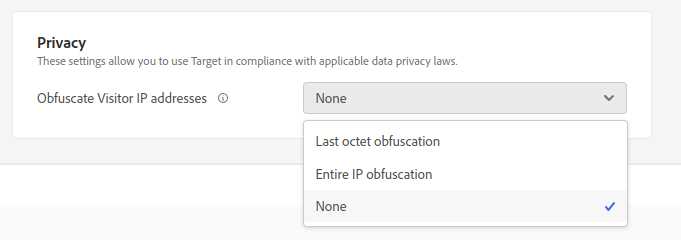

---
keywords:
- privacy
- ip address
- geosegmentation
- opt out
- optout
- opt-out
- data privacy
- government regulations
- regulations
- gdpr
- ccpa
description: Learn how Adobe Target complies with applicable data privacy laws including collection and handling of IP addresses, and opt-out instructions.
title: How Does Target Handle Privacy Issues?
feature: Privacy & Security
role: Developer
exl-id: fb632923-fa36-4553-88a6-f27860472eb6
---
# Privacy

Adobe Target has enabled processes and settings that allow you to use Target in compliance with applicable data privacy laws.

## Collection of feature-usage data

Individual feature-usage data is collected for internal Adobe purposes to identify whether Target features are performing as intended or to identify features that are being under-utilized. Various measurements of latency are collected to help address performance concerns. Personal data is not collected.

You can opt out of reporting usage data in our SDKs by setting `telemetryEnabled` to false in the client initialization options. For more information, see [telemetryEnabled in targetGlobalSettings](/src/pages/implement/client-side/atjs/atjs-functions/targetglobalsettings.md#telemetryenabled).

## Collection of IP addresses

The IP address of a visitor to your website is transmitted to an Adobe Data Processing Center (DPC). Depending on the network configuration for the visitor, the IP address does not necessarily represent the IP address of the visitor’s computer. For example, the IP address could be the external IP address of a Network Address Translation (NAT) firewall, HTTP proxy, or Internet gateway. Target doesn't store any IP addresses of the user or any Personally Identifiable Information (PII). IP addresses are used only by Target during the session (in-memory, never persisted).

## Replacement of last octet of IP addresses

Adobe has developed a “privacy by design” setting that users can enable for Adobe Target. When enabled, Adobe Target immediately obfuscates the last octet (the last portion) of the IP address at the time the IP address is collected. This anonymization is performed before any processing of the IP address, including before an optional geo-lookup of the IP address.

When this feature is enabled, the IP address is made sufficiently anonymous so it is no longer identifiable as personal information. As a result, Adobe Target can be used in compliance with data privacy laws in countries that do not permit the collection of personal information. Obtaining city-level information will likely be significantly impacted by the obfuscation of the IP address. Obtaining region- and country-level information should only be slightly impacted.

The following settings are available in the Target UI by navigating to **Administration** > **Implementation**:

* Last octet obfuscation: Target hides the last octet of the IP address.
* Entire IP obfuscation: Target hides the entire IP address.
* None: Target does not hide any part of the IP address.

Target receives the full IP address and obfuscates it (if set to Last octet or Entire IP) as specified. Target then holds the obfuscated IP address in memory during the session.

## GeoSegmentation

If you enable the replacement of the last octet of the IP address, the remaining values of the IP address can be analyzed using reports in Adobe Target. If the last octet of the IP address has not been obfuscated, then the full IP address can be analyzed in Adobe Target. You can use the GeoSegmentation feature to map out visitor location by geographic area. GeoSegmentation data is granular only to the city level or zip code level, and not to the individual level.

If IP addresses are completely obfuscated, GeoSegmentation and geo targeting is not available.

## Opt-out link

You can add an opt-out link to your sites to enable visitors to opt-out of all counting and content delivery.

1. Add the following link to your site:

   `<a href="https://clientcode.tt.omtrdc.net/optout"> Your Opt Out Language Here</a>` 

1. (Conditional) If you are using CNAME, the link should contain the "client=`clientcode` parameter, for example:
`https://my.cname.domain/optout?client=clientcode`.

1. Replace `clientcode` with your client code, and add the text or image to be linked to the opt-out URL.

Any visitor who clicks this link is not included in any mbox requests called from their browsing sessions until they delete their cookies, or for two years, whichever comes first. This works by setting a cookie for the visitor called `disableClient` in the `clientcode.tt.omtrdc.net` domain.

Even if you use a first-party cookie implementation, the provided opt-out is set via a 3rd-party cookie. If the client is using a first-party cookie only, Target checks whether an opt-out cookie is set. 

## Privacy and data protection regulations

See [Privacy and data protection regulations](/src/pages/before-implement/privacy/cmp-privacy-and-general-data-protection-regulation.md) for information about the European Union's General Data Protection Regulation (GDPR), the California Consumer Privacy Act (CCPA), and other international privacy requirements, and how these regulations impact your organization and Adobe Target.
