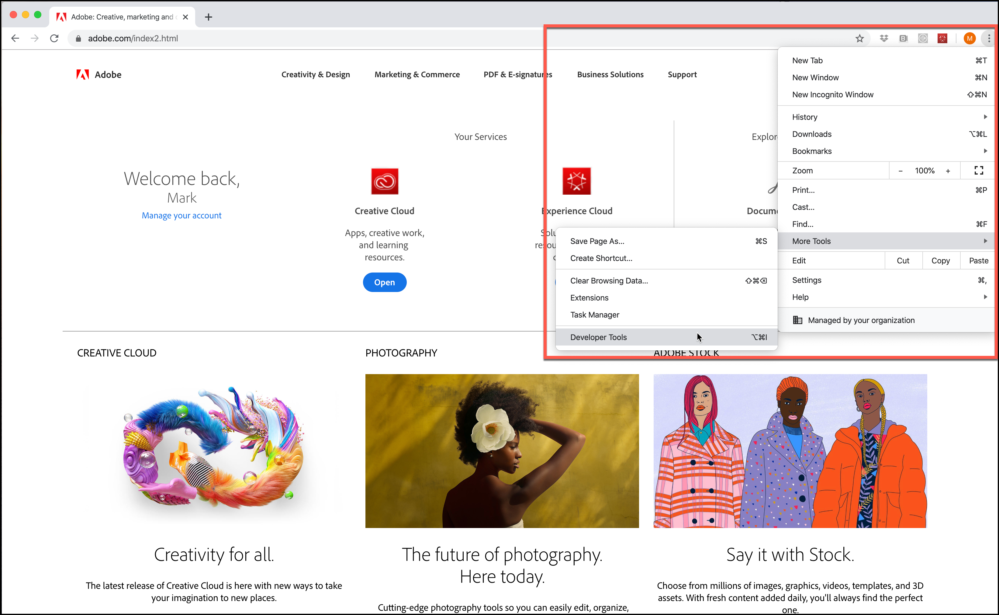
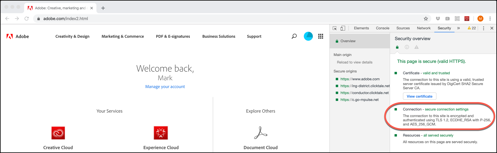

---
keywords:
- tls
- tls 1.0
- transport layer security
- encryption
- tls 1.1
- tls 1.2
description: Learn how Target uses the TLS (Transport Layer Security) protocol to maintain the highest security standards and promote the safety of your customer data.
title: How Does Target Use TLS to Provide Security?
feature: Privacy & Security
role: Developer
exl-id: 964a642a-830a-4556-a92a-d300670cd2fa
---
# TLS (Transport Layer Security) encryption changes

Information about changes to how Adobe and Adobe Target use TLS (Transport Layer Security) to maintain the highest security standards and promote the safety of customer data.

Transport Layer Security (TLS) is the most-widely deployed security protocol used today for web browsers and other applications that require data to be securely exchanged over a network. Adobe has security compliance standards that require the end-of-life of older protocols and is mandating the use of TLS 1.2 in order to have the most up-to-date and secure version in use. 

<InlineAlert variant="warning" slots="text"/>

As of March 1, 2020, Adobe Target no longer supports TLS 1.1 encryption for the Visual Experience Composer (VEC), Enhanced Experience Composer (EEC), activity delivery, APIs, etc. Please upgrade to TLS 1.2 to avoid any issues.

We do not expect this to have a significant impact on customer data or reporting.

## Visual Experience Composer (VEC) with Enhanced Experience Composer (EEC) Enabled

TLS 1.2 is the default as of March 1, 2020 and TLS 1.1 will no longer be supported.

Adobe will be moving customers in a phased manner to TLS 1.2. For those, whose domains are already 1.2 compliant, we will move them to TLS 1.2 without any changes needed from you. Most customer domains already support TLS 1.2; however, if your domain does not support TLS 1.2, we will keep those domains on TLS 1.1 like today (until March 2020).

You should not face any issue during this migration phase. If the VEC has stopped loading a site that was earlier working, [open a Client Care ticket](https://experienceleague.adobe.com/docs/target/using/cmp-resources-and-contact-information.html?#reference_ACA3391A00EF467B87930A450050077C) citing this migration as a possible cause.

If, however, you are one of those customers who are on TSL 1.1 without supporting TLS 1.2, then you should plan for movement of your domains/infrastructure to TLS 1.2. We will continue to support the TLS 1.1 protocol until March 1, 2020. Starting March 1, 2020, Target will not support the TLS 1.1 protocol to be used for the VEC via the Enhanced Experience Composer capability.

Although we strongly recommend everyone to be on TLS 1.2 going forward, if you are a new customer but do *NOT* support TLS 1.2, please reach out to Customer Care informing them that you need to be on TLS 1.1 for the Enhanced Experience Composer. However, please plan to move to TLS 1.2 as you will also not be supported beyond March 1, 2020.

## Activity delivery

Starting March 1, 2020, Target servers will no longer support TLS 1.1. With this change, Target servers will no longer accept requests from visitors with older devices or web browsers that do not support TLS 1.2 (or later). As a result, older devices and browsers that support only TLS 1.1 (or support TLS 1.1 by default) will not receive activity content from Adobe Target. The site's default content will render.

Some of the older devices and browsers that will be affected include:

* Google Chrome (Chrome for Android) versions 29 and earlier
* Opera Browser (Opera Mobile) versions 12.17 and earlier
* Mozilla Firefox (Firefox for Mobile) versions 26 and earlier
* Android 4.3 and earlier versions 
* Internet Explorer 8-10 on Windows 7 and earlier versions 
* Internet Explorer 10 on Windows Phone 8.0 
* Safari 6.0.4/OS X10.8.4 and earlier versions

As you plan for this change, consider the following (note that the March 1, 2020 deadline affects all of these items):

* You must ensure that your default site is ready in a manner that is consumable for compliant devices and browsers. 
* Be aware that the number of visitors in your Target reports can potentially see an insignificant drop in the number of visitors. 
* You might need to change audiences created specifically to target older devices or browsers that do not support TLS 1.2. Delivery to those devices and browsers will no longer work.

For more details about supported browsers and their versions, see [Supported Browsers](supported-browsers.md).

## Adobe Target APIs

Starting March 1, 2020, Target APIs will no longer support TLS 1.1 encryption. Customers who access the API should verify that they will not be impacted.

* API clients using Java 7 with default settings will need modifications to support TLS 1.2. For more information, see " [Changing default TLS protocol version for client end points: TLS 1.0 to TLS 1.2](https://www.java.com/en/configure_crypto.html)" on the Java website. 
* API clients using Java 8 should not be impacted because the default setting is TLS 1.2. 
* API clients using other frameworks will need to contact their vendors for details on TLS 1.2 support.

## Access to Experience Cloud Solutions interfaces

Because the Target Standard/Premium interface already requires a [modern web browser](supported-browsers.md), we do not anticipate issues. If you are unable to connect to Target, you should upgrade your browser to the latest version.

## How to check which TLS version your browser uses

To check the TLS version on your website using Google Chrome:

1. Open the affected website in Chrome.
1. From the Chrome menu (the three vertical ellipses), click More Tools > Developer Tools.

   

1. Open the Security tab, then examine the TLS version information under Connection:

   

<InlineAlert variant="info" slots="text"/>

These instructions are current as of publication and are subject to change. A quick internet search should help should these instructions change. Other browsers have similar steps.

## Expected behavior with browsers supporting TLS versions below 1.2

This section describes what to expect with browsers that support TLS versions below 1.2 only when using an at.js implementation. For comparison purposes, this section also describes what to expect with browsers that support TLS 1.2.

### Central endpoints

| Target JavaScript Implementation | Details |
|--- |--- |
|at.js|With TLS 1.0 or TLS 1.1 enabled:<ul><li>Using browser dev tools, on the Network tab, you'll see "200 OK." This means the request has succeeded.</li><li>User sees a "Can't connect securely to this page" message. The message explains that this might be caused because the site uses outdated or unsafe TLS security settings.</li><li>No console errors are displayed.</li></ul>With TLS 1.2 enabled:<ul><li>at.js file is downloaded.</li></ul>|

### Edge endpoints

| Target JavaScript Implementation | Details |
|--- |--- |
|Adobe Experience Platform Web SDK|With TLS 1.0 or TLS 1.1 enabled:<ul><li>Using browser dev tools, on the Network tab, you'll see "200 OK." This means the request has succeeded.</li><li>User sees a "Can't connect securely to this page" message. The message explains that this might be caused because the site uses outdated or unsafe TLS security settings.</li><li>No console errors are displayed.</li><li>Default content is served.</li></ul>With TLS 1.2 enabled:<ul><li>Offer content is served.</li></ul>|
|at.js|With TLS 1.0 or TLS 1.1 enabled:<ul><li>Using browser dev tools, on the Network tab, you'll see "200 OK." This means the request has succeeded.</li><li>User sees a "Can't connect securely to this page" message. The message explains that this might be caused because the site uses outdated or unsafe TLS security settings.</li><li>No console errors are displayed.</li><li>Default content is served.</li></ul>With TLS 1.2 enabled:<ul><li>Offer content is served.</li></ul>|

### Activity targeted with browser-version audience (Internet Explorer, Versions 6, 7, or 8)

<InlineAlert variant="info" slots="text"/>

Audiences stop working.

| Target JavaScript Implementation | Details |
|--- |--- |
|Adobe Experience Platform Web SDK|The Platform SDK is not supported on Internet Explorer versions earlier than version 10.|
|at.js|at.js is not supported on Internet Explorer versions earlier than version 10.|
