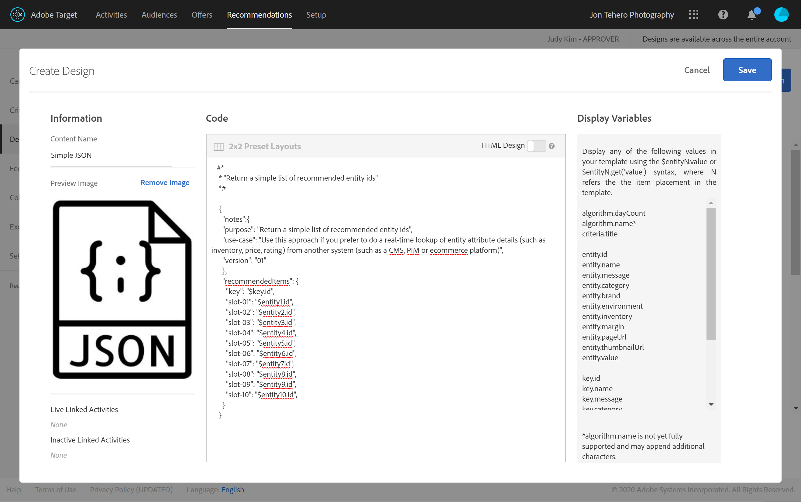
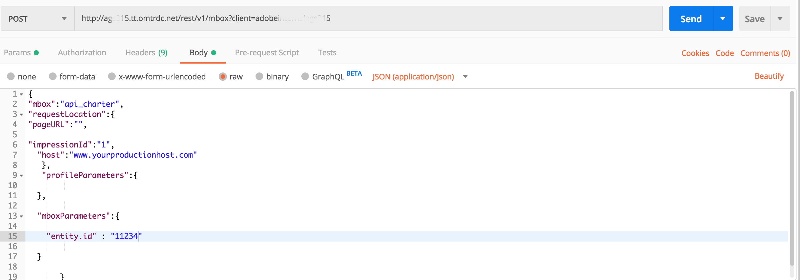
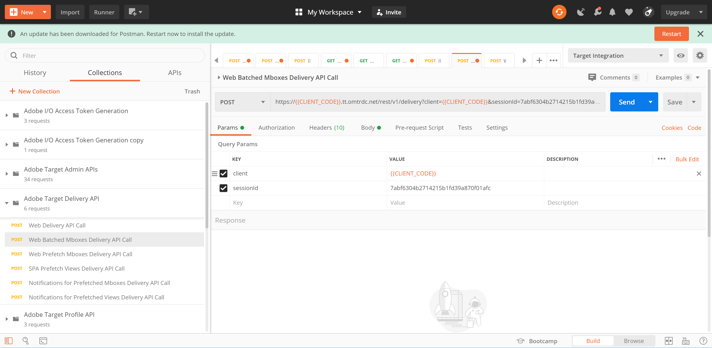

# Fetching [!DNL Recommendations] with the Delivery API

The Adobe Target and Adobe Target [!DNL Recommendations] APIs can be used to deliver responses to web pages, but can also be used in non-HTML based experiences including apps, screens, consoles, emails, kiosks and other display devices. In other words, when [!DNL Target] libraries and JavaScript cannot be used, the **[!DNL Target] Delivery API** still allows us to access the full range of [!DNL Target] functionality to deliver personalized experiences.

>[!NOTE]
>
> When requesting content containing actual recommendations (recommended products or items), use the [!DNL Target] Delivery API.

To retrieve recommendations, send an Adobe Target Delivery API POST call with the appropriate contextual information, which may include a user ID (for use with profile-specific recommendations such as the user's recently viewed items), relevant mbox name, mbox parameters, profile parameters, or other attributes. The response will include recommended entity.ids (and may include other entity data) in JSON or HTML format, which can then be displayed in the device.

The [Delivery API](https://developers.adobetarget.com/api/delivery-api/) for Adobe Target exposes all existing features that a standard [!DNL Target] request provides.

>[!NOTE]
>The Delivery API:
>* Enables you to retrieve experiences or offers for a location and an audience in a RESTful manner.
>* Requires no authentication.
>* Only POSTs.
>* Does not process cookies or redirect calls.
>* Does not require or recognize "user roles." It simply fetches content or reports events to [!DNL Target] edge servers.

To use the Delivery API to deliver [!DNL Target] experiences—including recommendations—follow these steps:

1. Create a [!DNL Target] activity (A/B, XT, AP, or [!DNL Recommendations]) using the Form-Based Composer (not the Visual Experience Composer).
2. Use the Delivery API to get a response for the requests generated by the [!DNL Target] activity you just created.

<!-- Q: Why are BOTH steps necessary for this? If you have a Form-based recommendation defined for an mbox, what's the point/benefit of ALSO having the Delivery API step in to retrieve results? Why can't you just have the Form-based Rec deliver the results in the destination device...?? A: See use case below... it's when you want to "intercept" the pending results in order to do more stuff prior to displaying the results. Things like real-time comparisons to inventory levels. -->

## Create a Recommendation using the Form-based Experience Composer

To create recommendations that can be used with the Delivery API, use the [Form-based Composer](https://docs.adobe.com/content/help/en/target/using/experiences/form-experience-composer.html). 

1. First, create and save a JSON-based design to use in your recommendation. For sample JSON, plus background information regarding how JSON responses can be returned when configuring a form-based activity, see the documentation on [Creating Recommendation Designs](https://docs.adobe.com/content/help/en/target/using/recommendations/recommendations-design/create-design.html). In this example, the design is named *Simple JSON.*
   

2. In [!DNL Target], navigate to **[!UICONTROL Activities] > [!UICONTROL Create Activity] > [!UICONTROL Recommendations]**, then select **[!UICONTROL Form]**.

   

3. Select a Property, and click **[!UICONTROL Next]**.
4. Define the location where you would like users to receive the recommendation's response. The example below uses a location named *api_charter*. Select your JSON-based design, created earlier, named *Simple JSON.*
   
5. Save and activate the recommendation. It will generate results. [Once the results are ready](https://docs.adobe.com/content/help/en/target/using/recommendations/recommendations-activity/previewing-and-launching-your-recommendations-activity.html), you can use the Delivery API to retrieve them.

## Use the Delivery API

The syntax for the [Delivery API](https://developers.adobetarget.com/api/delivery-api/#tag/Delivery-API) is:

`POST https://{{CLIENT_CODE}}.tt.omtrdc.net/rest/v1/delivery`

1. Note the client code is required. As a reminder, your client code may be found in Adobe Target by navigating to **[!UICONTROL Recommendations] > [!UICONTROL Settings]**. Note the **[!UICONTROL Client Code]** value in the **[!UICONTROL Recommendation API Token]** section.
   
1. Once you have your client code, construct your Delivery API call. The example below begins with the **[!UICONTROL Web Batched Mboxes Delivery API Call]** provided in the [Delivery API Postman collection](https://developers.adobetarget.com/api/delivery-api/#section/Getting-Started/Postman-Collection), making relevant modifications. For example:
   * the **browser** and **address** objects were removed from the **Body**, since they are not required for non-HTML use cases
   * *api_charter* is listed as the location name in this example
   * the entity.id is specified, since this recommendation is based on Content Similarity, which requires a current item key to be passed to [!DNL Target].
   
   Remember to configure your query parameters correctly. For example, be sure to specify `{{CLIENT_CODE}}` as necessary. <!--Q: In the updated call syntax, entity.id is listed as a profileParameter instead of an mboxParameter as in older versions. --> <!--Q: Old image  Old accompanying text: "Note this recommendation is based on Content Similar products based on the entity.id sent via mboxParameters." -->
   
1. Send the request. This executes against the *api_charter* location, which has an active recommendation running on it, defined with your JSON design which will output a list of recommended entities.
1. Receive a response based on the JSON design.
   
   The response includes the key ID, as well as the entity IDs of the recommended entities.

 Using the Delivery API with [!DNL Recommendations] in this way enables you to perform additional steps prior to displaying recommendations to the visitor on the non-HTML device. For example, you can take the response from the Delivery API to perform an additional, real-time lookup of entity attribute details (inventory, price, rating, and so on) from another system (such as a CMS, PIM or ecommerce platform), before displaying final results.
 
 Using the approach outlined in this tutorial, you can get any application to leverage the response from [!DNL Target] to provide personalized recommendations!

## Example Implementations

The following resources provide examples of various non-HTML focused implementations. Keep in mind every implementation will be unique, due to the system and devices involved.

|Resource|Details|
| --- | --- |
|[Consuming RESTful APIs in AEM](https://helpx.adobe.com/experience-manager/using/restful-services.html)|How to create and deploy an Adobe Experience Manager OSGi bundle that consumes data from a third-party RESTful web service.|
|[Adobe Target Everywhere - Implement Server Side or in the IoT](https://expleague.azureedge.net/labs/L733/index.html)|Adobe Summit 2019 Lab that provides hands-on experience for a React application that leverages Adobe Target server-side APIs.|
|[Adobe Target in a Mobile App Without the Adobe SDK](https://community.tealiumiq.com/t5/Universal-Data-Hub/Adobe-Target-in-a-Mobile-App-Without-the-Adobe-SDK/ta-p/26753)|This guide shows you how to set up Adobe Target in your mobile app without installing the Adobe SDK. This solution uses the Tealium SDK webview and the Remote Commands module to send and receive requests to the Adobe Visitor API (Experience Cloud) and the Adobe Target API.|
|[How Adobe Target Works in Mobile Apps](https://docs.adobe.com/content/help/en/target/using/implement-target/mobile-apps/mobile-how-target-works-mobile-apps.html)|How [!DNL Target] works with the Mobile SDK|
|[Configuring the [!DNL Target] extension in Experience Platform Launch and Implementing [!DNL Target] APIs](https://aep-sdks.gitbook.io/docs/using-mobile-extensions/adobe-target)|Steps for configuring the [!DNL Target] extension in Experience Platform Launch, adding the [!DNL Target] Extension to your app, and implementing [!DNL Target] APIs to request activities, prefetch offers, and Enter visual preview mode.|
|[Adobe Target Node Client](https://www.npmjs.com/package/@adobe/target-nodejs-sdk)|Open-sourced [!DNL Target] Node.js SDK v1.0|
|[Server Side overview](https://docs.adobe.com/content/help/en/target/using/implement-target/server-side/api-and-sdk-overview.html)|Information about Adobe Target Server Side delivery APIs, Server Side Batch Delivery APIs, Node.js SDK, and Adobe Target [!DNL Recommendations] APIs.|
|[Adobe Campaign Content Recommendations in Email](https://medium.com/adobetech/adobe-campaign-content-recommendations-in-email-b51ced771d7f )|Blog that describes how to leverage content recommendations in email via Adobe Target and Adobe I/O Runtime in Adobe Campaign.|

## Managing [!DNL Recommendations] Setup with APIs

Most of the time, recommendations are configured in the Adobe Target UI, then used or accessed via the [!DNL Target] APIs, for reasons such as the ones mentioned in the sections above. This UI-API coordination is common. However, sometimes users may want to perform all actions via APIs—both setup, as well as the use of results. Although much less common, users can absolutely configure, execute, *and* leverage the results of recommendations entirely using the APIs.

We learned in an [earlier section](manage-catalog.md) how to manage Adobe Target Recommendations entities and deliver them server-side. Similarly, Adobe I/O allows you to manage criteria, promotions, collections, and design templates without having to log in to Adobe Target. A complete list of all [!DNL Recommendations] APIs may be found [here](http://developers.adobetarget.com/api/recommendations/), but here is a summary for reference.

|Resource|Details|
| --- | --- |
|[Collections](http://developers.adobetarget.com/api/recommendations/#tag/Collections)|List, create, get, edit, and delete collections.|
|[Criteria](http://developers.adobetarget.com/api/recommendations/#tag/Criteria)|List and get criteria.|
|[Designs](http://developers.adobetarget.com/api/recommendations/#tag/Designs)|List, create, get, edit, delete, and validate designs.|
|[Entities](http://developers.adobetarget.com/api/recommendations/#tag/Entities)|Save, delete, and get entities.|
|[Promotions](http://developers.adobetarget.com/api/recommendations/#tag/Promotions)|List, create, get, edit, and delete promotions.|
|[Category Criteria](http://developers.adobetarget.com/api/recommendations/#tag/Category-Criteria)|List, create, get, edit, and delete category criteria.|
|[Custom Criteria](http://developers.adobetarget.com/api/recommendations/#tag/Custom-Criteria)|List, create, get, edit, and delete custom criteria.|
|[Item Criteria](http://developers.adobetarget.com/api/recommendations/#tag/Item-Criteria)|List, create, get, edit, and delete item criteria.|
|[Popularity Criteria](http://developers.adobetarget.com/api/recommendations/#tag/Popularity-Criteria)|List, create, get, edit, and delete popularity criteria.|
|[Profile Attribute Criteria](http://developers.adobetarget.com/api/recommendations/#tag/Profile-Attribute-Criteria)|List, create, get, edit, and delete profile attribute criteria.|
|[Recent Criteria](http://developers.adobetarget.com/api/recommendations/#tag/Recent-Criteria)|List, create, get, edit, and delete recent criteria.|
|[Sequence Criteria](http://developers.adobetarget.com/api/recommendations/#tag/Sequence-Criteria)|List, create, get, edit, and delete sequence criteria.|

## Reference documentation

* [Adobe Target API documentation](https://developers.adobetarget.com/api/#getting-started)
* [Adobe Target Delivery API](https://developers.adobetarget.com/api/delivery-api/)
* [Integrate [!DNL Recommendations] with email](https://docs.adobe.com/content/help/en/target/using/recommendations/recommendations-faq/integrating-recs-email.html)

## Summary and Review

Congratulations! By finishing this tutorial, you have learned how to:
* [Manage your catalog using the Recommendations API](manage-catalog.md)
* [Manage custom criteria using the Recommendations API](manage-custom-criteria.md)
* [Use the Delivery API with Recommendations](fetch-recs-server-side-delivery-api.md)
