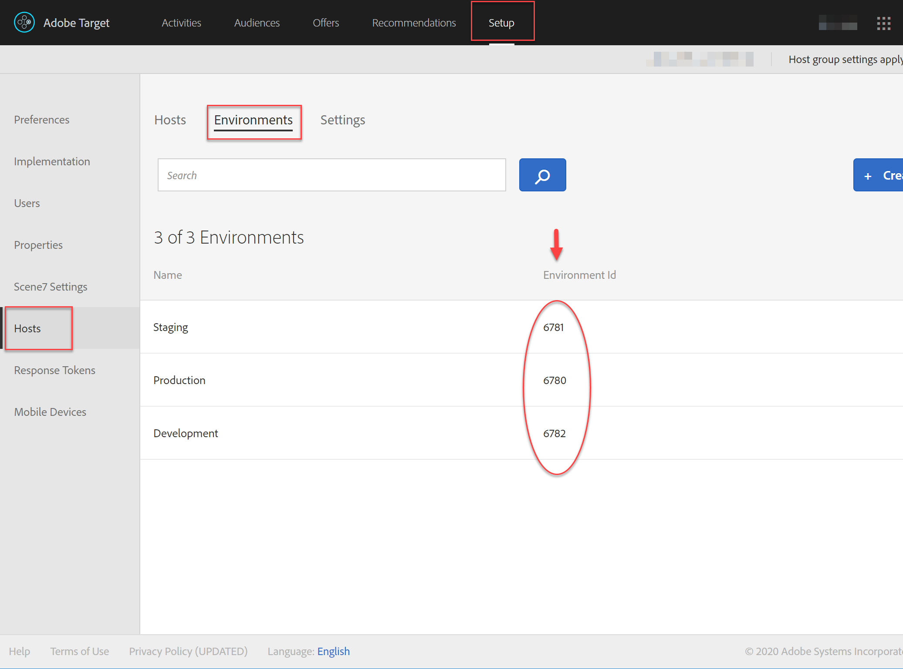
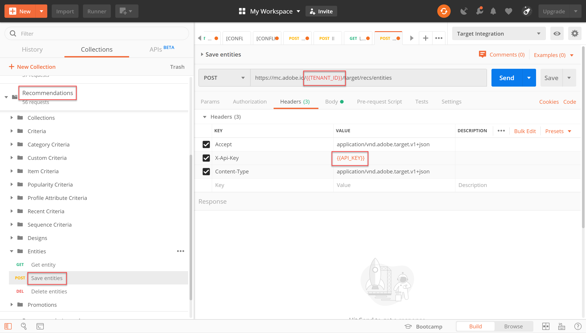
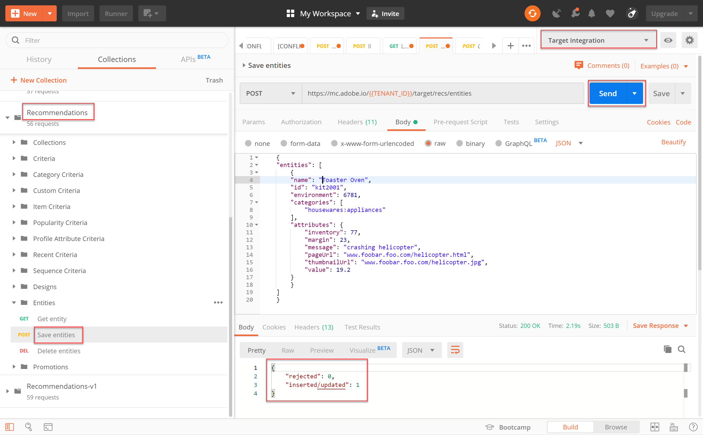
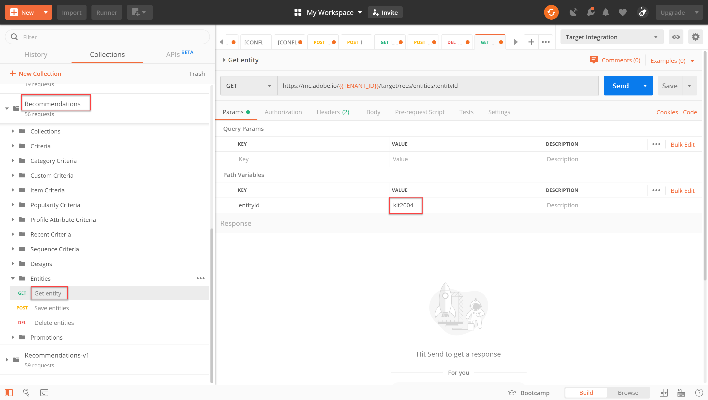
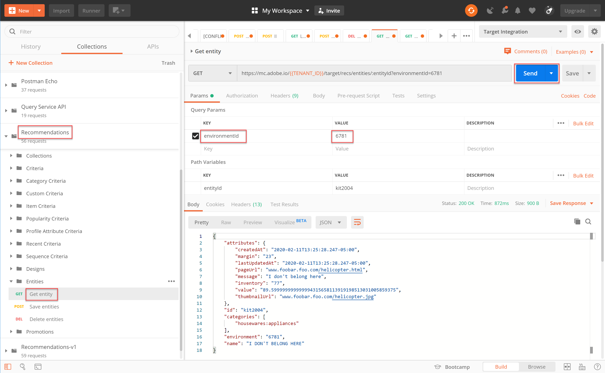
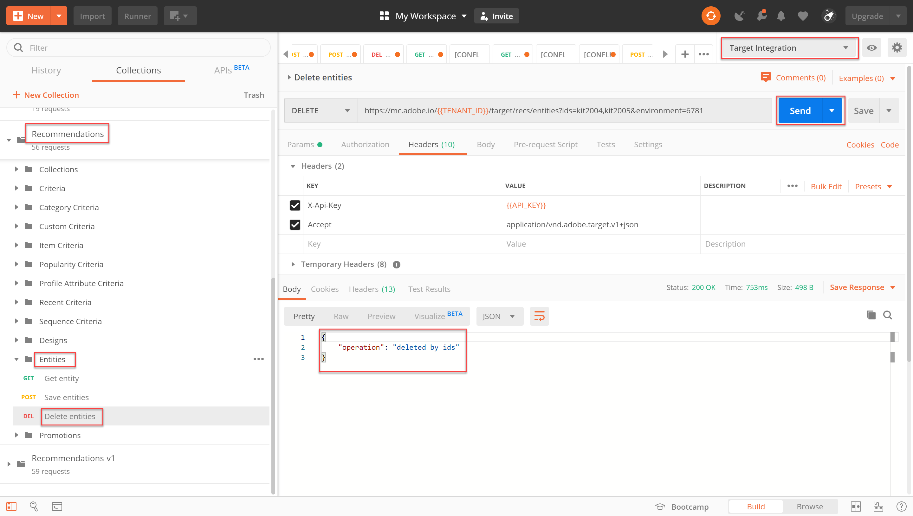
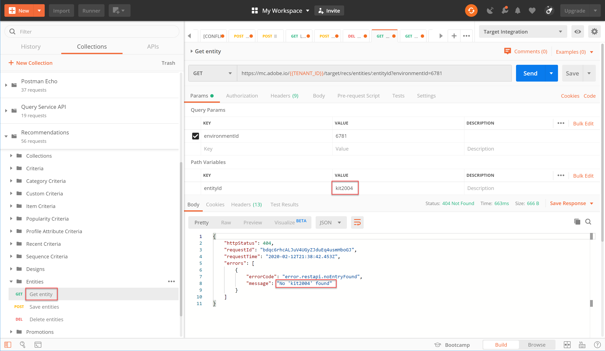

# Manage Your [!DNL Recommendations] Catalog using APIs

At this point, you have learned how to generate an access token, using the JWT authentication flow, to use the Adobe Target Admin APIs with Adobe I/O.
  
You can use the [Recommendations APIs](https://developers.adobetarget.com/api/recommendations/) to add, update, or delete items in your recommendations catalog. As with the rest of the Adobe Target Admin APIs, the [!DNL Recommendations] APIs require authentication.

>[!TIP]
>
>Send the **[!UICONTROL IMS: JWT Generate + Auth via User Token]** request whenever you need to refresh your access token for authentication, since it expires after 24 hours. See [Configure Adobe API Authentication](../apis/configure-io-target-integration.md) for instructions.


>[!NOTE]
>
>Before proceeding, get the [Recommendations Postman collection](https://developers.adobetarget.com/api/recommendations/#section/Postman).

## Creating and updating items with the Save Entities API

To populate your [!DNL Recommendations] product database using the API rather than a CSV product feed or [!DNL Target] requests firing on product pages, use the [Save Entities API](https://developers.adobetarget.com/api/recommendations/#operation/saveEntities). This request adds or updates an item in a single [!DNL Target] environment. The syntax is:

```
POST https://mc.adobe.io/{{TENANT_ID}}/target/recs/entities
```

For example, Save Entities may be used to update items whenever certain thresholds are met—such as thresholds for inventory or price—in order to flag those items and prevent them from being recommended.

1. Navigate to **[!DNL Target] > [!UICONTROL Setup] > [!UICONTROL Hosts] > [!UICONTROL Environments]** to obtain the [!DNL Target] Environment ID in which you want to add or update an item.

    

2. Verify `TENANT_ID` and `API_KEY` reference the Postman environment variables established earlier. Use the image below for comparison. If necessary, modify the Headers and path in your API request to match those in the image below.

    

3. Enter your JSON as **raw** code in the **Body**. Don't forget to specify your environment ID, using the `environment` variable. (In the example below, the environment ID is 6781.)

    

   >![NOTE]
   >
   >Below is sample JSON that adds entity.id kit2001 with associated entity values for a Toaster Oven product, into environment 6781.
   >
   >```
   >    {
   >    "entities": [{
   >            "name": "Toaster Oven",
   >            "id": "kit2001",
   >            "environment": 6781,
   >            "categories": [
   >                "housewares:appliances"
   >            ],
   >            "attributes": {
   >                "inventory": 77,
   >                "margin": 23,
   >                "message": "crashing helicopter",
   >                "pageUrl": "www.foobar.foo.com/helicopter.html",
   >                "thumbnailUrl": "www.foobar.foo.com/helicopter.jpg",
   >                "value": 19.2
   >            }
   >        }]
   >    }
   >```

4. Click **Send**. You should receive the following response.

    

The JSON object can be scaled to send multiple products. For example, this JSON specifies two entities.

```
    {
        "entities": [{
                "name": "Toaster Oven",
                "id": "kit2001",
                "environment": 6781,
                "categories": [
                    "housewares:appliances"
                ],
                "attributes": {
                    "inventory": 89,
                    "margin": 11,
                    "message": "Toaster Oven",
                    "pageUrl": "www.foobar.foo.com/helicopter.html",
                    "thumbnailUrl": "www.foobar.foo.com/helicopter.jpg",
                    "value": 102.5
                }
            },
            {
                "name": "Blender",
                "id": "kit2002",
                "environment": 6781,
                "categories": [
                    "housewares:appliances"
                ],
                "attributes": {
                    "inventory": 36,
                    "margin": 5,
                    "message": "Blender",
                    "pageUrl": "www.foobar.foo.com/helicopter.html",
                    "thumbnailUrl": "www.foobar.foo.com/helicopter.jpg",
                    "value": 54.5
                }
            }
        ]
    }
```

1. Now it's your turn! Use the **Save Entities** API to add the following items to your catalog. Use the sample JSON above as a starting point. (You will need to extend the JSON to include additional entities.)

    

Whoops, looks like those last two items don't belong. Let's inspect them using the **Get Entity** API, and if necessary, delete them using the **Delete Entities** API.

## Getting item details with the Get Entity API

To retrieve the details of an existing item, use the [Get Entity API](https://developers.adobetarget.com/api/recommendations/#operation/getEntity). The syntax is:

```
GET https://mc.adobe.io/{{TENANT_ID}}/target/recs/entities/[entity.id]
```

Entity details can only be retrieved for a single entity at a time. You can use Get Entity to confirm updates were made in the catalog as expected, or to otherwise audit the contents of the catalog.

1. In the API request, specify the entity ID, using the variable `entityId`. The following example will return details for the entity whose entityId=kit2004.

   

2. Verify `TENANT_ID` and `API_KEY` reference the Postman environment variables established earlier. Use the image below for comparison. If necessary, modify the Headers and path in your API request to match those in the image below.

    

3. Send the request.

    
    If you receive an error stating the entity was not found, as shown in the example above, verify you are submitting the request to the correct [!DNL Target] environment.

    >[!NOTE]
    >
    >If no environment is explicitly specified, Get Entity attempts to get the entity from your [default environment](https://docs.adobe.com/content/help/en/target/using/administer/hosts.html#section_4F8539B07C0C45E886E8525C344D5FB0) only. If you wish to pull from any environment other than your default environment, you must specify the environment ID.

4. If necessary, add the `environmentId` parameter, and re-send the request.

   

5. Send another **Get Entity** request, this time to inspect the entity whose entityId=kit2005.

   

Suppose you decide these entities need to be removed from your catalog. Let's use the **Delete Entities** API.

## Deleting items with the Delete Entities API

To remove items from your catalog, use the [Delete Entities API](https://developers.adobetarget.com/api/recommendations/#operation/deleteEntities). The syntax is:

```
DELETE https://mc.adobe.io/{{TENANT_ID}}/target/recs/entities?ids=[comma-delimited-entity-ids]&environment=[environmentId]
```

>[!WARNING]
>
>This API deletes entities referenced by IDs you specify.
>
>If no entity IDs are provided, all entities in the given environment are deleted. If no environment ID is given, entities will be deleted from all environments. Use this with caution!

1. Navigate to **[!DNL Target] > [!UICONTROL Setup] > [!UICONTROL Hosts] > [!UICONTROL Environments]** to obtain the [!DNL Target] Environment ID from which you want to delete items.

    

2. In the API request, specify the entity IDs of the entities you want to delete, using the syntax `&ids=[comma-delimited-entity-ids]` (a query parameter). When deleting more than one entity, separate the IDs using commas.

    

3. Specify the environment ID, using the syntax `&environment=[environmentId]`, otherwise entities across all environments will be deleted.

    

4. Verify `TENANT_ID` and `API_KEY` reference the Postman environment variables established earlier. Use the image below for comparison. If necessary, modify the Headers and path in your API request to match those in the image below.

    

5. Send the request.

    

6. Verify your results using **Get Entity**, which should now indicate the deleted entities cannot be found.

    

    

Congrats! You can now use the [!DNL Recommendations] APIs to create, update, delete, and obtain details on the entities in your catalog. In the next section, you will learn how to manage custom criteria.

[Next "Manage Custom Criteria" >](manage-custom-criteria.md)
