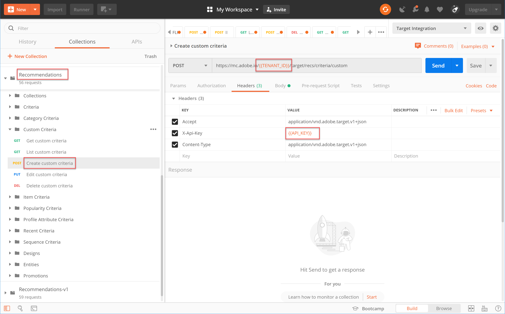
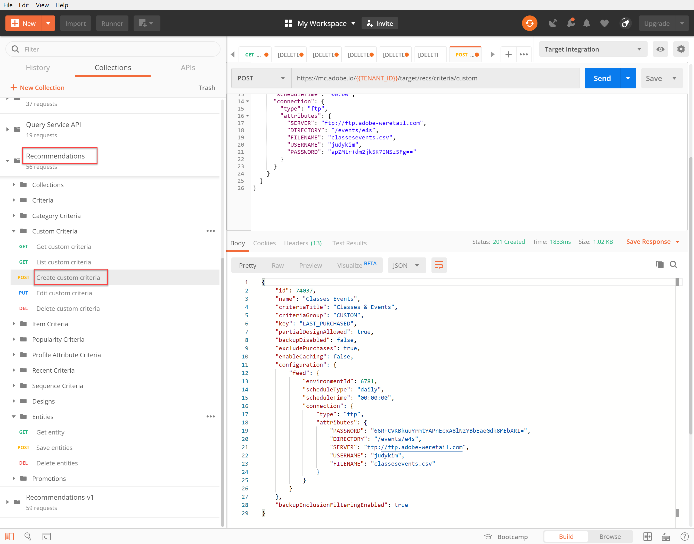
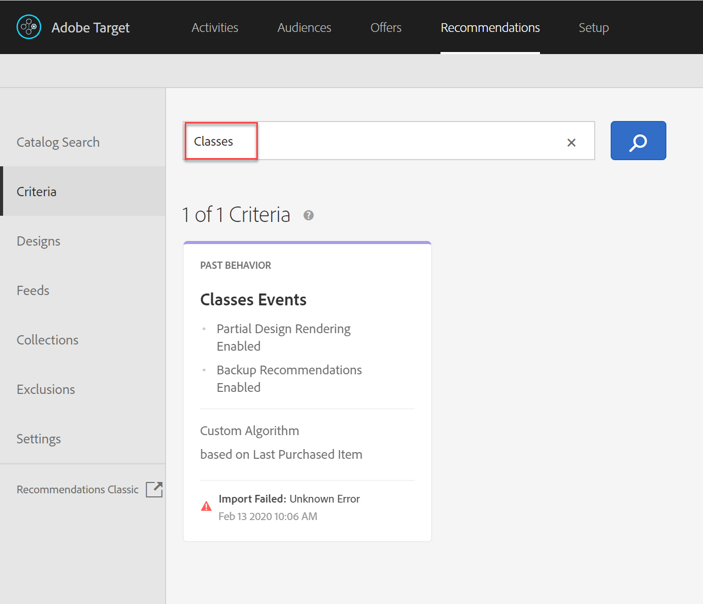
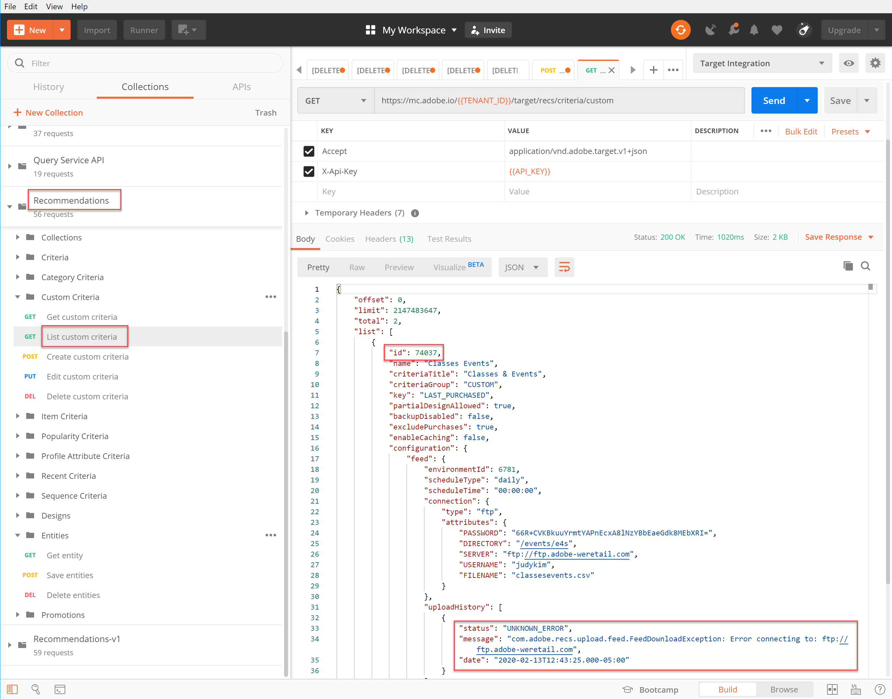
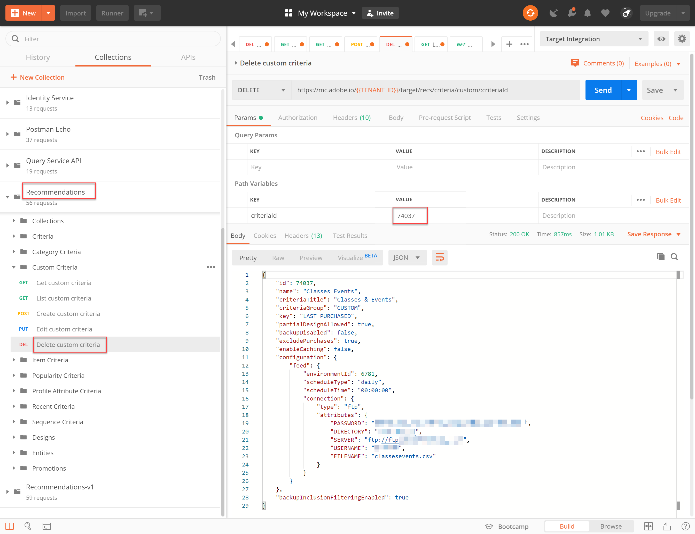
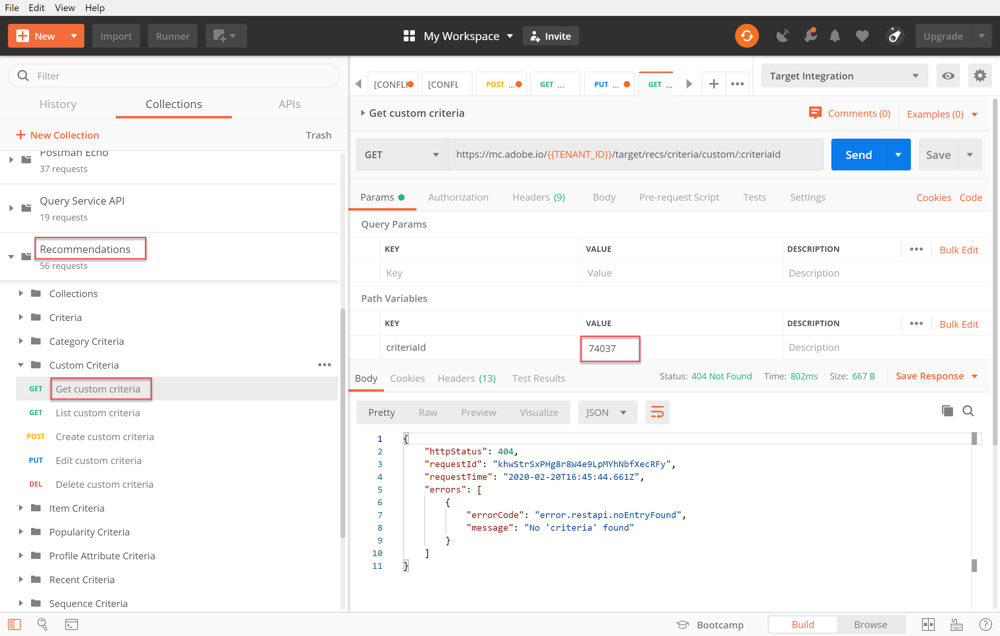

# Manage Custom Criteria

Sometimes the algorithms provided by [!DNL Recommendations] are not able to surface particular items you would like to promote. In such a situation, custom criteria provide a way for you to deliver a specific set of recommended items for a given key item or category. You define the mapping between the key item or category and the recommended items, and import that mapping as a custom criteria. This process is described in the [custom criteria documentation](https://docs.adobe.com/content/help/en/target/using/recommendations/criteria/recommendations-csv.html). As noted in that documentation, you are able to create, edit, and delete custom criteria through the [!DNL Target] user interface (UI). However, [!DNL Target] also provides a set of Custom Criteria APIs that allow for more detailed management of your custom criteria.

>[!IMPORTANT]
>
>Follow this usage guideline for custom criteria:
>
> Either do everything (create, edit, delete) for a given custom criteria using the APIs, or else do everything (create, edit, delete) using the UI. Managing your custom criteria through a combination of the UI and the API may lead to conflicting information or unexpected results. For example, creating a custom criteria in the UI but then editing it via API will not reflect your updates in the UI, even though it will be updated in the backend, as visible via the API.

## Create Custom Criteria

To create custom criteria using the [Create Custom Criteria API](https://developers.adobetarget.com/api/recommendations/#operation/createCriteriaCustom), the syntax is:

`POST https://mc.adobe.io/{{TENANT_ID}}/target/recs/criteria/custom`

>[!WARNING]
>
>Custom criteria created using the Create Custom Criteria API, as described in this exercise, will appear in the UI, where they will persist. You will not be able to edit or delete them from the UI. You may edit or delete them **via API**, but either way, they will continue to appear in the [!DNL Target] UI. To maintain the option of editing or deleting from the UI, create the custom criteria using the UI per [the documentation](https://docs.adobe.com/content/help/en/target/using/recommendations/criteria/recommendations-csv.html), as opposed to using the Create Custom Criteria API.

Only proceed with this tutorial after you have read the warning above and are comfortable creating new custom criteria that cannot subsequently be deleted from the UI.

1. Verify `TENANT_ID` and `API_KEY` for **Create custom criteria** reference the Postman environment variables established earlier. Use the image below for comparison.

    

2. Add your **Body** as **raw** JSON that defines the location of your custom criteria CSV file. Use the example provided in the [Create Custom Criteria API](https://developers.adobetarget.com/api/recommendations/#operation/getAllCriteriaCustom) documentation as a template, supplying your `environmentId` and other values as necessary. For this example, we use LAST_PURCHASED as the key.

    

3. Send the request and observe the response, which contains the details of the custom criteria you just created.

    

4. To verify your custom criteria has been created, navigate within Adobe Target to **[!UICONTROL Recommendations] > [!UICONTROL Criteria]** and search for your criteria by name, or use the **List Custom Criteria API** in the next step.

    

In this case, we have an error. Let's investigate the error by examining the custom criteria more closely, using the **List Custom Criteria API**.

## List Custom Criteria

To retrieve a list of all your custom criteria along with details for each, use the [List Custom Criteria API](https://developers.adobetarget.com/api/recommendations/#operation/getAllCriteriaCustom). The syntax is:

`GET https://mc.adobe.io/{{TENANT_ID}}/target/recs/criteria/custom`

1. Verify `TENANT_ID` and `API_KEY` as before, and send the request. In the response, note the custom criteria ID, as well as details regarding the error message noted earlier.
   

In this case, the error occurred because the server information is incorrect, meaning [!DNL Target] is unable to access the CSV file containing the custom criteria definition. Let's edit the custom criteria to correct this.

## Edit Custom Criteria

To change the details of a custom criteria definition, use the [Edit Custom Criteria API](https://developers.adobetarget.com/api/recommendations/#operation/updateCriteriaCustom). The syntax is:

`POST https://mc.adobe.io/{{TENANT_ID}}/target/recs/criteria/custom/:criteriaId`

1. Verify `TENANT_ID` and `API_KEY`, as before.

1. Specify the criteria ID of the (single) custom criteria you would like to edit.

1. In the Body, supply updated JSON with the correct server information. (For this step, specify FTP access to a server you can access.)

1. Send the request and note the response.

Let's verify the success of the updated custom criteria, using the **Get Custom Criteria API**.

## Get Custom Criteria

To view custom criteria details for a specific custom criteria, use the [Get Custom Criteria API](https://developers.adobetarget.com/api/recommendations/#operation/getCriteriaCustom). The syntax is:

`GET https://mc.adobe.io/{{TENANT_ID}}/target/recs/criteria/custom/:criteriaId`

1. Specify the criteria ID of the custom criteria whose details you would like to get. Send the request, and review the response.

1. Verify success. (In our case, verify there are no further FTP errors.)
   
1. (Optional) Verify the update reflects accurately in the UI.
   

## Delete Custom Criteria

Using the criteria ID noted earlier, delete your custom criteria, using the [Delete Custom Criteria API](https://developers.adobetarget.com/api/recommendations/#operation/deleteCriteriaCustom). The syntax is:

`DELETE https://mc.adobe.io/{{TENANT_ID}}/target/recs/criteria/custom/:criteriaId`

1. Specify the criteria ID of the (single) custom criteria you would like to delete. Click **Send**.
   

1. Verify the criteria has been deleted using Get Custom Criteria.
   
   In this case, the expected 404 error indicates the deleted criteria cannot be found.

>[!NOTE]
>As a reminder, the criteria will not be removed from the [!DNL Target] UI even though it was deleted, because it was created using the Create Custom Criteria API.

Congratulations! You are now able to create, list, edit, delete, and get details on custom criteria, using the [!DNL Recommendations] API. In the next section, you will use the [!DNL Target] Delivery API to retrieve recommendations.

[Next "Fetch Recommendations with the Server-side Delivery API" >](fetch-recs-server-side-delivery-api.md)
