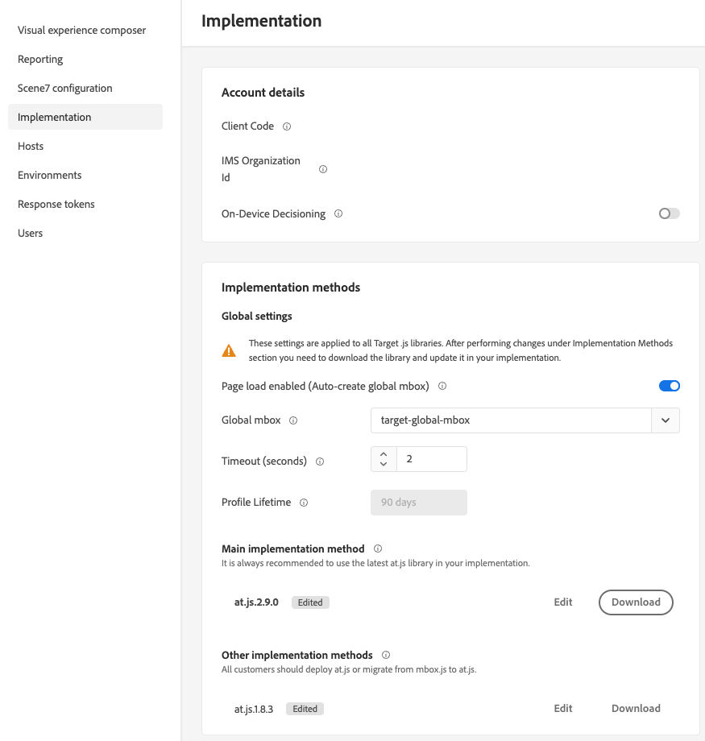

---
keywords:
- global mbox
- customize global mbox
- edit at.js
- at.js
- implement at.js
description: Learn how to customize a global mbox for at.js on the Administration-Implementation page in Adobe Target.
title: How Do I Customize a Global mbox?
feature: at.js
role: Developer
exl-id: 6d3eab89-818c-405c-81af-90dfbede7390
---
# Customize a global mbox

Information to help you customize an Adobe Target global mbox for at.js.

1. Click **Administration** > **Implementation**.

2. Disable **Page load enabled (Auto create global mbox)**, then add the name of the custom global mbox that you would like to use to deliver activities from Target.

<InlineAlert variant="warning" slots="text"/>

The change is automatically saved when you select a different global mbox.

   This custom global mbox is also used for click tracking.

   

3. Implement the at.js library on your site.

   See [How to deploy at.js](/src/pages/implement/client-side/atjs/how-to-deployatjs/how-to-deployatjs.md) for more information.

4. Time the transition with your release.

   When you are ready for Target to start using your global mbox for all activities in the future, you can proceed with this step.

   Update the name of the custom global mbox to match the name used in Step 2, above.

<InlineAlert variant="warning" slots="text"/>

All activities in your account sync with this mbox. Ensure that the global mbox is present on your site so that activities continue functioning. Be sure to edit and re-save affected activities that were created with the Visual Experience Composer (VEC) that sync with this mbox. It is not necessary to re-save activities created in the Form-Based Experience Composer or via API.

