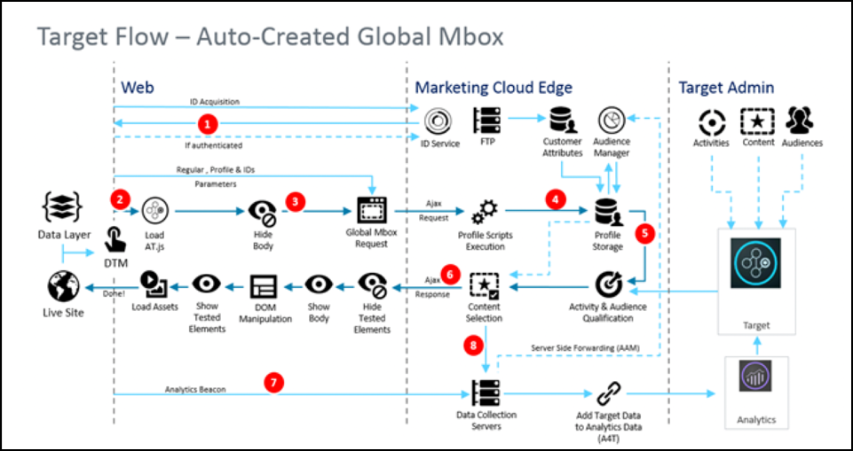

---
keywords:
- system diagram
- flicker
- at.js
- implementation
- javascript library
- js
- atjs
description: Learn how the Target at.js JavaScript library functions, including system diagrams to help you understand the workflow as pages load.
title: How Does the at.js Javascript Library Work?
feature: at.js
role: Developer
exl-id: 2193c02a-2a85-4ae1-bfbd-40fa7b87f0a0
---
# How at.js works

To implement Adobe Target client-side, you must use the at.js JavaScript library. 

In a client-side implementation of Adobe Target, Target delivers the experiences associated with an activity directly to the client browser. The browser decides which experience to display and displays it. With a client-side implementation, you can use a WYSIWYG editor, the [Visual Experience Composer](https://experienceleague.adobe.com/docs/target/using/experiences/vec/visual-experience-composer.html) (VEC), or a non-visual interface, the [Form-based Experience Composer](https://experienceleague.adobe.com/docs/target/using/experiences/form-experience-composer.html), to create your test and personalization experiences.

## What is at.js?

The at.js library is the implementation library for client-side implementation of Adobe Target. The at.js library improves page-load times for web implementations and provides better implementation options for single-page applications. at.js is the recommended implementation library and is updated frequently with new capabilities. We recommend that all customers implement or migrate to the [latest version of at.js](/src/pages/implement/client-side/atjs/target-atjs-versions.md).

For more information, see [Target JavaScript libraries](https://experienceleague.adobe.com/docs/target/using/introduction/how-target-works.html#libraries).

In the Target implementation illustrated below, the following Adobe Experience Cloud solutions are implemented: Analytics, Target, and Audience Manager. In addition, the following Experience Cloud core services are implemented: Adobe Experience Platform, Audiences, and Visitor ID Service.

## What is the difference between at.js 1.*x* and at.js 2.x workflow diagrams?

See [Upgrading from at.js 1.x to at.js 2.x](/src/pages/implement/client-side/atjs/upgrading-from-atjs-1x-to-atjs-20.md) for more information on the differences that were introduced in 2.O from 1.*x*.

From a high level view, there are a couple of differences between the two versions:

* at.js 2.x does not have a global mbox request concept but rather a page-load request. A page-load request can be viewed as a request to retrieve content that should be applied on the initial page load of your website.
* at.js 2.x manages  a concepts called Views, which are use for Single Page Applications (SPAs). at.js 1.*x* is not aware of this concept.

## at.js 2.x diagrams

The following diagrams help you understand the workflow of at.js 2.x with Views and how this enhances the SPA integration. To get a better introduction of the concepts used in at.js 2.x, see [Single Page Application implementation](/src/pages/implement/client-side/atjs/how-to-deployatjs/target-atjs-single-page-application.md).

|Step|Details|
| --- | --- |
|1|Call returns the Experience Cloud ID if the user is authenticated; another call syncs the customer ID.|
|2|The at.js library loads synchronously and hides the document body. at.js can also be loaded asynchronously with an optional prehiding snippet implemented on the page.|
|3|A page load request is made including all configured parameters (MCID, SDID, and customer ID).|
|4|Profile scripts execute and then feed into the Profile Store. The Store requests qualified audiences from the Audience Library (for example, audiences shared from Adobe Analytics, Audience Management, etc.). Customer attributes are sent to the Profile Store in a batch process.|
|5|Based on URL request parameters and profile data, Target decides which activities and experiences to return to the visitor for the current page and future views.|
|6|Targeted content is sent back to the page, optionally including profile values for additional personalization. Targeted content on the current page is revealed as quickly as possible without flicker of default content. Targeted content for views that are shown as a result of user actions in a SPA is cached in the browser so it can be instantly applied without an additional server call when the views are triggered through `triggerView()`.|
|7|Analytics data is sent to Data Collection servers.|
|8|Targeted data is matched to Analytics data via the SDID and is processed into the Analytics reporting storage. Analytics data can then be viewed in both Analytics and Target via Analytics for Target (A4T) reports.|

Now, wherever `triggerView()` is implemented on your SPA, the Views and actions are retrieved from cache and shown to the user without a server call. `triggerView()` also makes a notifications request to the Target backend in order to increment and record impression counts. For more information on at.js for SPAs with Views, see [Single Page Application implementation](/src/pages/implement/client-side/atjs/how-to-deployatjs/target-atjs-single-page-application.md).

|Step|Details|
| --- | --- |
|1|`triggerView()` is called in the SPA to render the View and apply actions to modify visual elements.|
|2|Targeted content for the view is read from the cache.|
|3|Targeted content is revealed as quickly as possible without flicker of default content.|
|4|Notification request is sent to the Target Profile Store to count the visitor in the activity and increment metrics.|
|5|Analytics data sent to Data Collection Servers.|
|6|Target data is matched to Analytics data via the SDID and is processed into the Analytics reporting storage. Analytics data can then be viewed in both Analytics and Target via A4T reports.|

### Video - at.js 2.x architectural diagram

at.js 2.x enhances Adobe Target's support for SPAs and integrates with other Experience Cloud solutions. This video explains how everything comes together.

<iframe
src="https://video.tv.adobe.com/v/26250"
frameBorder="0"
height="270"
width="480"
webkitallowfullscreen="true"
mozallowfullscreen="true"
allowFullScreen>
</iframe>

See [Understanding how at.js 2.x works](https://experienceleague.adobe.com/docs/target-learn/tutorials/implementation/understanding-how-atjs-20-works.html) for more information.

## at.js 1.x diagram

| Step | Description | Call | Description |
|--- |--- |--- |--- |
|1|Call returns the Experience Cloud ID (MCID) if the user is authenticated; another call syncs the customer ID.|2|The at.js library loads synchronously and hides the document body.|
|3|A global mbox request is made including all configured parameters, MCID, SDID, and customer ID (optional).|4|Profile scripts execute and then feed into the Profile Store. The Store requests qualified audiences from the Audience Library (for example, audiences shared from Adobe Analytics, Audience Manager, etc.). Customer attributes are sent to the Profile Store in a batch process.|
|5|Based on the URL, mbox parameters, and profile data, Target decides which activities and experiences to return to the visitor.|6|Targeted content is sent back to page, optionally including profile values for additional personalization. The experience is revealed as quickly as possible without flicker of default content.|
|7|Analytics data is sent to Data Collection servers.|8|Target data is matched to Analytics data via the SDID and is processed into the Analytics  reporting storage. Analytics data can then be viewed in both Analytics and  Target via Analytics for Target (A4T) reports.|

### Video - Office hours: at.js tips and overview (June 26, 2019)

This video is a recording of "Office Hours," an initiative led by the Adobe Customer Care team.

* Benefits of using at.js
* at.js settings
* Flicker handling
* Debugging at.js
* Known issues
* FAQ

<iframe
src="https://video.tv.adobe.com/v/27959"
frameBorder="0"
height="270"
width="480"
webkitallowfullscreen="true"
mozallowfullscreen="true"
allowFullScreen>
</iframe>

## How at.js renders offers with HTML content

When rendering offers with HTML content, at.js applies the following algorithm:

1. Images are preloaded (if there are any `` tags in HTML content).

1. HTML content is attached to the DOM node.

1. Inline scripts are executed (code enclosed in `<script>` tags).

1. Remote scripts are loaded asynchronously and executed (`<script>` tags with `src` attributes).

Important notes:

* at.js does not provide any guarantees on the order of remote script execution, as these are loaded asynchronously.
* Inline scripts should not have any dependencies on remote scripts, as these are loaded and executed later.
