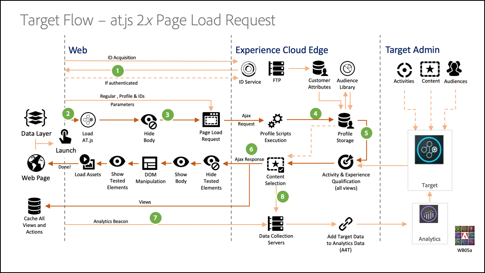
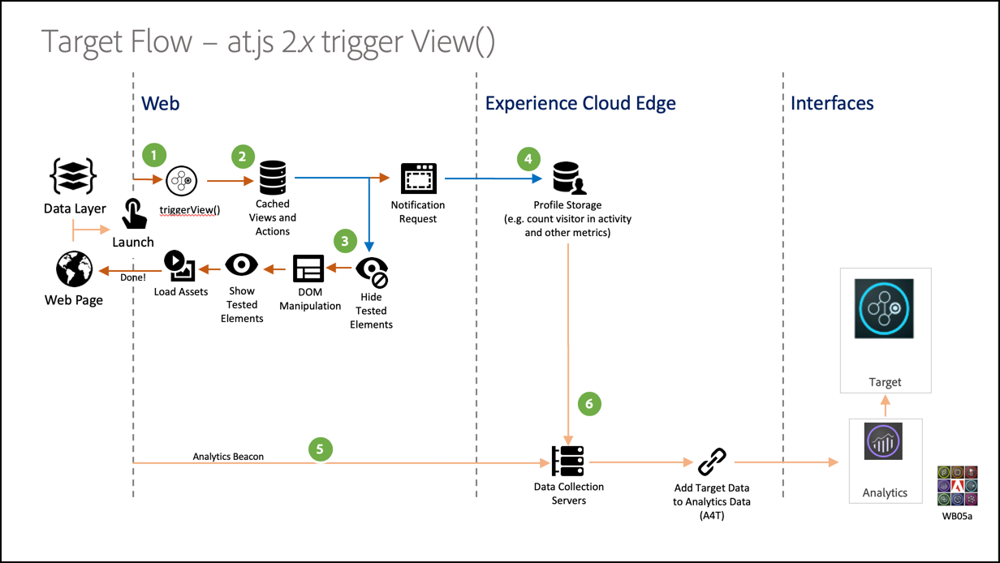

---
keywords:
- single page application implementation
- implement single page application
- spa
- at.js 2.x
- at.js
- single page application
- single page app
- spa
- SPAs
description: Learn how to use Adobe Target at.js 2.x to implement Target for Single Page Applications (SPAs).
title: Can I implement Target for Single Page Applications (SPAs)?
feature: Implement Server-side
role: Developer
exl-id: 624f8e62-b443-4093-8e05-9320a365ea07
---
# Single Page Application implementation

Traditional websites worked on "Page-to-Page" navigation models, otherwise known as Multi Page Applications, where website designs were tightly coupled to URLs and transitions from one webpage to another required a page load. Modern web applications, such as Single Page Applications (SPAs), instead adopt a model that propels rapid use of browser UI rendering, which is often independent of page reloads. These experiences are often triggered by customer interactions, such as scrolls, clicks, and cursor movements. As the paradigms of the modern web have evolved, the relevance of traditional generic events, such as page-load, to deploy personalization and experimentation no longer work.


at.js 2.x provides rich features that equip your business to execute personalization on next-generation, client-side technologies. This version is focused on improving at.js to have harmonious interactions with SPAs. 

Here are some benefits to using at.js 2.x that are not available in previous versions:

* Ability to cache all offers on page-load to reduce multiple server calls to a single server call. 
* Tremendously improve your end-users' experiences on your site because offers are shown immediately via the cache without lag time introduced by traditional server calls.
* A simple one-line of code and one-time developer setup to enable your marketers to create and run A/B and Experience Targeting (XT) activities via the VEC on your SPA. 

## Adobe Target Views and Single Page Applications

The Adobe Target VEC for SPAs takes advantage of a new concept called Views: a logical group of visual elements that together make up an SPA experience. A SPA can, therefore, be considered as transitioning through views, instead of URLs, based on user interactions. A View can typically represent a whole site or grouped visual elements within a site.

To explain further about what Views are, let’s navigate this hypothetical online e-commerce site implemented in React and explore some example Views. Click the links below to open this site in a new browser tab.

**Link: [Home Site](https://target.enablementadobe.com/react/demo/#/)**


When we navigate to the home site, we can immediately see a hero image that promotes an Easter sale as well as the newest products that is selling on the site. In this case, a View can be defined as the entire home site. This is handy to note as we will expand on this more in the Implementing Adobe Target Views section below.

**Link: [Product Site](https://target.enablementadobe.com/react/demo/#/products)**


As we become more interested in the products that the business is selling, we decide to click the Products link. Similar to the home site, the entirety of the products site can be defined as a View. We can name this View "products" just like the path name in `https://target.enablementadobe.com/react/demo/#/products)`.


In the beginning of this section, we defined Views as the whole site or even a group of visual elements on the site. As shown above, the four products shown on the site can also be grouped and considered as a View. If we wanted to name this View, we can name it to be "Products."


We decide to click the Load More button to explore more products on the site. The website URL does not change in this case. But a View here can represent only the second row of products shown above. The View name can be called "PRODUCTS-PAGE-2."

**Link: [Checkout](https://target.enablementadobe.com/react/demo/#/checkout)**


Because we liked some products shown on the site, we decided to buy a couple. Now, on the checkout site we are given some options to choose normal delivery or express delivery. Because a View can be any group of visual elements on a site, we can name this "View Delivery Preferences." 

Furthermore, the Views concept can be extended much further than this. If marketers want to personalize content on the site depending on which delivery preference is selected, a View can be created for each delivery preference. In this case, when we select Normal Delivery, the View can be named "Normal Delivery." If Express Delivery is selected, the View can be named "Express Delivery." 

Now, marketers might want to run an A/B Test to see whether changing the color from blue to red when Express Delivery is selected can boost conversions, as opposed to keeping the button color blue for both delivery options. 

## Implementing Adobe Target Views

Now that we have covered what Adobe Target Views are, we can leverage this concept in Target to empower marketers to run A/B and XT tests on SPAs via the VEC. This will require a one-time developer setup. Let’s go through the steps to set this up.

1. Install at.js 2.x.

   First, we need to install at.js 2.x. This version of at.js was developed with SPAs in mind. Previous versions of at.js and mbox.js (now deprecated) do not support Adobe Target Views and the VEC for SPAs.

   Download at.js 2.x via the Adobe Target UI located in **Administration > Implementation**. at.js 2.x can also be deployed via tags in Adobe Experience Platform.

2. Implement at.js 2.x’s newest function, `triggerView()` on your sites.

   After defining the Views of your SPA where you want to run an A/B or XT test, implement at.js 2.x’s `triggerView()` function with the Views passed in as a parameter. This allows marketers to use the VEC to design and run the A/B and XT tests for those Views defined. If the `triggerView()` function is not defined for those Views, the VEC will not detect the Views and thus marketers cannot use the VEC to design and run A/B and XT tests.

   **`adobe.target.triggerView(viewName, options)`**

   |Parameter|Type|Required?|Validation|Description|
   | --- | --- | --- | --- | --- |
   |viewName|String|Yes|1. No trailing spaces.<br />2. Cannot be empty.<br />3. View name should be unique for all pages.<br />4. **Warning**: View name should not start or end with '`/`'. This is because the customer would generally extract the View name from URL path. For us, "home" and "`/home`" are different.<br />5. **Warning**: Same view should not be consecutively triggered multiple times with the  `{page: true}` option.|Pass in any name as a string type that you want to represent your View. This View name displays in the **Modifications** panel of the VEC for marketers to create actions and run their A/B and XT activities.|
   |options|Object|No|||
   |options > page|Boolean|No||**TRUE**: Default value of page is true. When `page=true`, notifications will be sent to the Edge servers for incrementing impression count.<br />**FALSE**: When `page=false`, notifications will not be sent for incrementing impression count. This should be used when you want to only re-render a component on a page with an offer.|

   Now let’s go through some example use cases on how to invoke the `triggerView()` function in React for our hypothetical  e-commerce SPA:

   **Link: [Home Site](https://target.enablementadobe.com/react/demo/#/)**

   

   As marketers, if we want to run A/B tests on the whole home site, then we might want to name the view "home":

  ```
   function targetView() {
     var viewName = window.location.hash; // or use window.location.pathName if router works on path and not hash

     viewName = viewName || 'home'; // view name cannot be empty

     // Sanitize viewName to get rid of any trailing symbols derived from URL
     if (viewName.startsWith('#') || viewName.startsWith('/')) {
       viewName = viewName.substr(1);
     }
  
     // Validate if the Target Libraries are available on your website
     if (typeof adobe != 'undefined' && adobe.target && typeof adobe.target.triggerView === 'function') {
       adobe.target.triggerView(viewName);
     }
   }

   // react router v4
   const history = syncHistoryWithStore(createBrowserHistory(), store);
   history.listen(targetView);

   // react router v3
   <Router history={hashHistory} onUpdate={targetView} >
  ```

   **Link: [Products Site](https://target.enablementadobe.com/react/demo/#/products)**

   Now, let’s look at an example that is a little bit more complicated. Let’s say as marketers, we want to personalize the second row of the products by changing the "Price" label color to red after a user clicked the Load More button.

   

  ```
   function targetView(viewName) {
     // Validate if the Target Libraries are available on your website
     if (typeof adobe != 'undefined' && adobe.target && typeof adobe.target.triggerView === 'function') {
       adobe.target.triggerView(viewName);
     }
   }

   class Products extends Component {
     render() {
       return (
         <button type="button" onClick={this.handleLoadMoreClicked}>Load more</button>
       );
     }

     handleLoadMoreClicked() {
       var page = this.state.page + 1; // assuming page number is derived from component’s state
       this.setState({page: page});
       targetView('PRODUCTS-PAGE-' + page);
     }
   }
  ```

   **Link: [Checkout](https://target.enablementadobe.com/react/demo/#/checkout)**

   

   If marketers want to personalize content on the site depending on which delivery preference is selected, a View can be created for each delivery preference. In this case, when we select Normal Delivery, the View can be named "Normal Delivery." If Express Delivery is selected, the View can be named "Express Delivery." 

   Now, marketers might want to run an A/B test to see whether changing the color from blue to red when Express Delivery is selected can boost conversions as opposed to keeping the button color blue for both delivery options.  

  ```
   function targetView(viewName) {
     // Validate if the Target Libraries are available on your website
     if (typeof adobe != 'undefined' && adobe.target && typeof adobe.target.triggerView === 'function') {
       adobe.target.triggerView(viewName);
     }
   }

   class Checkout extends Component {
     render() {
       return (
         <div onChange={this.onDeliveryPreferenceChanged}>
           <label>
             <input type="radio" id="normal" name="deliveryPreference" value={"Normal Delivery"} defaultChecked={true}/>
             <span> Normal Delivery (7-10 business days)</span>
           </label>

           <label>
             <input type="radio" id="express" name="deliveryPreference" value={"Express Delivery"}/>
             <span> Express Delivery* (2-3 business days)</span>
           </label>
         </div>
       );
     }
     onDeliveryPreferenceChanged(evt) {
       var selectedPreferenceValue = evt.target.value;
       targetView(selectedPreferenceValue);
     }
   }
  ```

## at.js 2.x system diagrams

The following diagrams help you understand the workflow of at.js 2.x with Views and how this enhances the SPA integration. To get a better introduction of the concepts used in at.js 2.x, see [Single Page Application implementation](/src/pages/implement/client-side/atjs/how-to-deployatjs/target-atjs-single-page-application.md).



|Step|Details|
| --- | --- |
|1|Call returns the Experience Cloud ID if the user is authenticated; another call syncs the customer ID.|
|2|The at.js library loads synchronously and hides the document body.<br />at.js can also be loaded asynchronously with an option prehiding snippet implemented on the page.|
|3|A page load request is made including all configured parameters (MCID, SDID, and customer ID).|
|4|Profile scripts execute and then feed into the Profile Store. The Store requests qualified audiences from the Audience Library (for example, audiences shared from Adobe Analytics, Audience Management, etc.).<br />Customer attributes are sent to the Profile Store in a batch process.|
|5|Based on URL request parameters and profile data, Target decides which activities and experiences to return to the visitor for the current page and future views.|
|6|Targeted content is sent back to the page, optionally including profile values for additional personalization.<br />Targeted content on the current page is revealed as quickly as possible without flicker of default content.<br />Targeted content for views that are shown as a result to user actions in a SPA that is cached in the browser so it can be instantly applied without an additional server call when the views are triggered through `triggerView()`.|
|7|Analytics data is sent to Data Collection servers.|
|8|Targeted data is matched to Analytics data via the SDID and is processed into the Analytics reporting storage.<br />Analytics data can then be viewed in both Analytics and Target via Analytics for Target (A4T) reports.|

Now, wherever `triggerView()` is implemented on your SPA, the Views and actions are retrieved from cache and shown to the user without a server call. `triggerView()` also makes a notifications request to the Target backend in order to increment and record impression counts.



|Step|Details|
| --- | --- |
|1|`triggerView()` is called in the SPA to render the View and apply actions to modify visual elements.|
|2|Targeted content for the view is read from the cache.|
|3|Targeted content is revealed as quickly as possible without flicker of default content.|
|4|Notification request is sent to the Target Profile Store to count the visitor in the activity and increment metrics.|
|5|Analytics data sent to Data Collection Servers.|
|6|Target data is matched to Analytics data via the SDID and is processed into the Analytics reporting storage. Analytics data can then be viewed in both Analytics and Target via A4T reports.|

## Single Page App Visual Experience Composer

After you have completed installing at.js 2.x and adding `triggerView()` to your site, use the VEC to run A/B and XT activities. For more information, see [Single Page App (SPA) Visual Experience Composer](https://experienceleague.adobe.com/docs/target/using/experiences/spa-visual-experience-composer.html).

<InlineAlert variant="info" slots="text"/>

The VEC for SPAs is really the same VEC that you use on regular web pages, but some additional capabilities are available when you open a single page app with `triggerView()` implemented.

## Use TriggerView to ensure that A4T works correctly with at.js 2.x and SPAs

To ensure that [Analytics for Target](https://experienceleague.adobe.com/docs/target/using/integrate/a4t/a4t.html) (A4T) works correctly with at.js 2.x, be sure to send the same SDID in the Target request and in the Analytics request.

As best practices related to SPAs:

* Use custom events to notify that something interesting happens in the application
* Fire a custom event before the view starts rendering
* Fire a custom event when the view finishes rendering

at.js 2.x added a new API [triggerView()](/src/pages/implement/client-side/atjs/atjs-functions/adobe-target-triggerview-atjs-2.md) function. You should use `triggerView()` to notify at.js that a view will start rendering.

To see how to combine custom events, at.js 2.x, and Analytics, let's see an example. This example assumes that the HTML page contains the Visitor API, followed by at.js 2.x, followed by AppMeasurement.

Let's assume that the following custom events exist:

* `at-view-start` - When the view starts rendering
* `at-view-end` - When the view finishes rendering

To make sure that A4T works with at.js 2.x,

The view start handler should look something like this:

```jsx
document.addEventListener("at-view-start", function(e) {
  var visitor = Visitor.getInstance("<your Adobe Org ID>");
  
  visitor.resetState();
  adobe.target.triggerView("<view name>");
});
```

The view end handler should look something like this:

```jsx
document.addEventListener("at-view-end", function(e) {
  // s - is the AppMeasurement tracker object
  s.t();
});
```

<InlineAlert variant="info" slots="text"/>

You must fire the `at-view-start` and `at-view-end` events. These events are not part of at.js custom events.

Although these examples use JavaScript code, all this can be simplified if you are using a tag manager, such as tags in [Adobe Experience Platform](/src/pages/implement/client-side/atjs/how-to-deployatjs/implement-target-using-adobe-launch.md).

If the preceding steps are followed you should have a robust A4T solution for SPAs.

## Implementation best practices

at.js 2.x APIs let you customize your Target implementation in many ways, but it is important to follow the correct order of operations during this process.

The following information describes the order of operations that you must follow when loading a Single Page Application for the first time in a browser and for any view change that happens afterwards.

### Order of operations for initial page load

|Step|Action|Details|
| --- | --- | --- |
|1|Load VisitorAPI JS|This library is responsible for assigning an ECID to the visitor. This ID is later consumed by other Adobe solutions on the web page.|
|2|Load at.js 2.x|at.js 2.x loads all the necessary APIs that you use to implement Target requests and views.|
|3|Execute Target request|If you have a data layer, we recommend that you load critical data that is required to send to Target before executing a Target request. This lets you use `targetPageParams` to send any data you want to use for targeting. You must ensure that you request for execute > pageLoad as well as prefetch > views in this API call. if you have set `pageLoadEnabled` and `viewsEnabled`, then both execute > pageLoad and prefetch > views automatically happen with Step 2; otherwise, you need to use the `getOffers()` API to make this request.|
|4|Call `triggerView()`|Because the Target request you initiated in Step 3 could return experiences for both Page Load execution as well as Views, ensure that `triggerView()` is called after the Target request is returned and finishes applying the offers to cache. You must execute this step only once per view.|
|5|Call the Analytics page view beacon|This beacon sends the SDID associated with Step 3 and 4 to Analytics for data stitching.|
|6|Call additional `triggerView({"page": false})`|This is an optional step for SPA frameworks that could potentially re-render certain components on the page without a view change happening. On such occasions, it is important that you invoke this API to ensure that Target experiences are re-applied after the SPA framework has re-rendered the components. You can execute this step as many times as you want to ensure that Target experiences persist in your SPA views.|

### Order of operations for SPA view change (no full page reload)

|Step|Action|Details|
| --- | --- | --- |
|1|Call `visitor.resetState()`|This API ensures that the SDID is re-generated for the new view as it loads.|
|2|Update cache by calling the `getOffers()` API|This is an optional step to take if this view change has a potential to qualify the current visitor for more Target activities or disqualify them from activities. At this point, you can also choose to send additional data to Target for enabling further targeting capabilities.|
|3|Call `triggerView()`|If you have executed Step 2, then you must wait for the Target request and apply the offers to cache before execute this step. You must execute this step only once per view.|
|4|Call `triggerView()`|If you have not executed Step 2, then you can execute this step as soon as you complete Step 1. If you have executed Step 2 and Step 3, then you should skip this step. You must execute this step only once per view.|
|5|Call the Analytics page view beacon|This beacon sends the SDID associated with Step 2, 3, and 4 to Analytics for data stitching.|
|6|Call additional `triggerView({"page": false})`|This is an optional step for SPA frameworks that could potentially re-render certain components on the page without a view change happening. On such occasions, it is important that you invoke this API to ensure that Target experiences are re-applied after the SPA framework has re-rendered the components. You can execute this step as many times as you want to ensure that Target experiences persist in your SPA views.|

## Training videos

The following videos contain more information:

### Understanding how at.js 2.x works 

<iframe
src="https://video.tv.adobe.com/v/26250"
frameBorder="0"
height="270"
width="480"
webkitallowfullscreen="true"
mozallowfullscreen="true"
allowFullScreen>
</iframe>

See [Understanding how at.js 2.x works](https://experienceleague.adobe.com/docs/target-learn/tutorials/implementation/understanding-how-atjs-20-works.html) for more information.

### Implement at.js 2.x in a SPA 

<iframe
src="https://video.tv.adobe.com/v/26248"
frameBorder="0"
height="270"
width="480"
webkitallowfullscreen="true"
mozallowfullscreen="true"
allowFullScreen>
</iframe>

See [Implement Adobe Target's at.js 2.x in a Single Page Application (SPA)](https://experienceleague.adobe.com/docs/target-learn/tutorials/experiences/use-the-visual-experience-composer-for-single-page-applications.html) for more information.

### Using the VEC for SPAs in Adobe Target 

<iframe
src="https://video.tv.adobe.com/v/26249"
frameBorder="0"
height="270"
width="480"
webkitallowfullscreen="true"
mozallowfullscreen="true"
allowFullScreen>
</iframe>

See [Using the Visual Experience Composer for Single Page Application (SPA VEC) in Adobe Target](https://experienceleague.adobe.com/docs/target-learn/tutorials/experiences/use-the-visual-experience-composer-for-single-page-applications.html) for more information.
