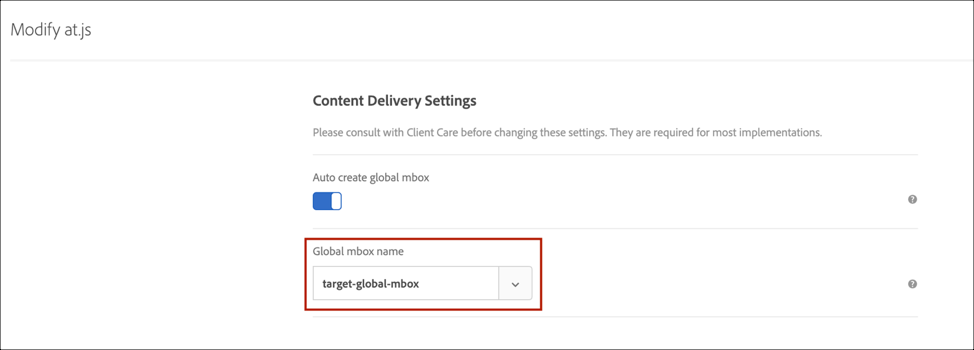

---
keywords:
- at.js releases
- at.js versions
- single page app
- spa
- cross domain
- cross-domain
description: Learn how to upgrade from Adobe Target at.js 1.x to at.js 2.x. Examine system flow diagrams, learn about new and deprecated functions, and more.
title: How Do I Upgrade from at.js Version 1.x to Version 2.x?
feature: at.js
role: Developer
exl-id: f5ec6bf1-f38c-4681-a6c1-b862272ee55d
---
# Upgrading from at.js 1.*x* to at.js 2.*x* 

The newest version of at.js in Adobe Target provides rich feature sets that equip your business to execute personalization on next-generation, client-side technologies. This new version is focused on upgrading at.js to have harmonious interactions with single page applications (SPAs). 

Here are some benefits of using at.js 2.*x* that are not available in previous versions:

* The ability to cache all offers on page-load to reduce multiple server calls to a single server call.
* Tremendously improve your end-users' experiences on your site because offers are shown immediately via the cache without any lag time that traditional server calls introduce.
* Simple one-line of code and one-time developer setup to enable your marketers to create and run A/B and XT activities via the VEC on your SPAs.

## at.js 2.*x* system diagrams

The following diagrams help you understand the workflow of at.js 2.*x* with Views and how this enhances the SPA integration. To get a better introduction of the concepts used in at.js 2.*x*, see [Single Page Application implementation](/src/pages/implement/client-side/atjs/how-to-deployatjs/target-atjs-single-page-application.md).


|Call|Details|
| --- | --- |
|1|Call returns the Experience Cloud ID if the user is authenticated; another call syncs the customer ID.|
|2|The at.js library loads synchronously and hides the document body.<br />at.js can also be loaded asynchronously with an option prehiding snippet implemented on the page.|
|3|A page load request is made including all configured parameters (MCID, SDID, and customer ID).|
|4|Profile scripts execute and then feed into the Profile Store. The Store requests qualified audiences from the Audience Library (for example, audiences shared from Adobe Analytics, Audience Management, etc.).<br />Customer attributes are sent to the Profile Store in a batch process.|
|5|Based on URL request parameters and profile data, Target decides which activities and experiences to return to the visitor for the current page and future views.|
|6|Targeted content is sent back to the page, optionally including profile values for additional personalization.<br />Targeted content on the current page is revealed as quickly as possible without flicker of default content.<br />Targeted content for views that are shown as a result to user actions in a SPA that is cached in the browser so it can be instantly applied without an additional server call when the views are triggered through `triggerView()`.|
|7|Analytics data is sent to Data Collection servers.|
|8|Targeted data is matched to Analytics data via the SDID and is processed into the Analytics reporting storage.<br />Analytics data can then be viewed in both Analytics and Target via Analytics for Target (A4T) reports.|

Now, wherever `triggerView()` is implemented on your SPA, the Views and actions are retrieved from cache and shown to the user without a server call. `triggerView()` also makes a notifications request to the Target backend in order to increment and record impression counts.


|Call|Details|
| --- | --- |
|1|`triggerView()` is called in the SPA to render the View and apply actions to modify visual elements.|
|2|Targeted content for the view is read from the cache.|
|3|Targeted content is revealed as quickly as possible without flicker of default content.|
|4|Notification request is sent to the Target Profile Store to count the visitor in the activity and increment metrics.|
|5|Analytics data sent to Data Collection Servers.|
|6|Target data is matched to Analytics data via the SDID and is processed into the Analytics reporting storage. Analytics data can then be viewed in both Analytics and Target via A4T reports.|

## Deploy at.js 2.*x*

Deploy at.js 2.*x* via tags in [Adobe Experience Platform](/src/pages/implement/client-side/atjs/how-to-deployatjs/implement-target-using-adobe-launch.md) extension. 

<InlineAlert variant="info" slots="text"/>

Deploying at.js using tags in Adobe Experience Platform is the preferred method.

Or

Manually download at.js 2.*x* using the Target UI and deploy it using the [method of your choice](/src/pages/implement/client-side/atjs/how-to-deployatjs/how-to-deployatjs.md).

## Deprecated at.js functions

There are several functions that have been deprecated in at.js 2.*x*. 

<InlineAlert variant="warning" slots="text"/>

If these deprecated functions are still used on your site when at.js 2.*x* is deployed, you will see console warnings. The recommended approach when upgrading is to test the deployment of at.js 2.*x* in a staging environment and make sure to go through each and every warning that has been logged in the console and translate the deprecated functions to new functions introduced in at.js 2.*x*. 

You can find the deprecated functions and their counterpart below. For a complete list of functions, see [at.js functions](/src/pages/implement/client-side/atjs/atjs-functions/atjs-functions.md).

<InlineAlert variant="info" slots="text"/>

at.js 2.*x* no longer automatically pre-hides `mboxDefault` marked elements. Customers will therefore have to accommodate for the pre-hide logic manually on the site or through a tag manager.

### mboxCreate(mbox,params)

**Description**: 

Executes a request and applies the offer to the closest DIV with the `mboxDefault` class name.

**Example**:

```html
<div class="mboxDefault">
  default content to replace by offer
</div>
<script>
  mboxCreate('mboxName','param1=value1','param2=value2');
</script>
```

**at.js 2.*x* equivalent**

An alternative to `mboxCreate(mbox, params)` is `getOffer()` and `applyOffer()`.

**Example**:

```html
<div class="mboxDefault"> 
  default content to replace by offer 
</div> 
<script> 
  var el = document.currentScript.previousElementSibling;
  adobe.target.getOffer({
    mbox: "mboxName",
    params: {
      param1: "value1",
      param2: "value2"
    },
    success: function(offer) {
      adobe.target.applyOffer({
        mbox: "mboxName",
        selector: el,
        offer: offer
      });
    },
    error: function(error) {
      console.error(error);
      el.style.visibility = "visible";
    }
  });
</script> 
```

### mboxDefine() and mboxUpdate()

**Description**:

Creates an internal mapping between an element and an mbox name, but does not execute the request. Used in conjunction with `mboxUpdate()`, which executes the request and applies the offer to the element identified by the nodeId in `mboxDefine()`. Can also be used to update an mbox initiated by `mboxCreate`.

**Example**:

```html
<div id="someId" class="mboxDefault"></div>
<script>
 mboxDefine('someId','mboxName','param1=value1','param2=value2');
 mboxUpdate('mboxName','param3=value3','param4=value4');
</script>
```

**at.js 2.*x* equivalent**:

An alternative to `mboxDefine()` and `mboxUpdate` is `getOffer()` and `applyOffer()`, with the selector option used in `applyOffer()`. This approach lets you map the offer to an element using any CSS selector, not just one with an ID.

**Example**:

```html
<div id="someId" class="mboxDefault"> 
  default content to replace by offer 
</div> 
<script> 
  adobe.target.getOffer({
    mbox: "mboxName",
    params: {
      param1: "value1",
      param2: "value2",
      param3: "value3",
      param4: "value4" 
    },
    success: function(offer) {
      adobe.target.applyOffer({
        mbox: "mboxName",
        selector: "#someId",
        offer: offer
      });
    },
    error: function(error) {
      console.error(error);
      var el = document.getElementById("someId");
      el.style.visibility = "visible";
    }
  });
</script>
```

### adobe.target.registerExtension()

**Description**:

Provides a standard way to register a specific extension.

This is no longer supported and should not be used.

## Summary of deprecated, new, and supported at.js functions in 2.*x*

|Method|Supported?|New?|Deprecated?<br />(Default content will be shown)|
| --- | --- | --- | --- |
|`getOffer()`|Yes|||
|`getOffers()`||Yes||
|`applyOffer()`|Yes|||
|`applyOffers()`||Yes||
|`triggerView()`||Yes||
|`trackEvent()`|Yes|||
|`mboxCreate()`|||Yes|
|`mboxDefine()`<br />`mboxUpdate()`|||Yes|
|`targetGlobalSettings()`|Yes|||
|`Data Providers`|Yes|||
|`targetPageParams()`|Yes|||
|`targetPageParamsAll()`|Yes|||
|`registerExtension()`|||Yes|
|`At.js Custom Events`|Yes|||

## Limitations and callouts

Be aware of the following limitations and callouts:

### Conversion tracking

Customers using `mboxCreate()` for conversion tracking must use `trackEvent()` or `getOffer()`.

### Offer delivery

Customers who do not replace `mboxCreate()` with `getOffer()` or `applyOffer()` risk not having offers delivered.

### Can at.js 2.*x* be used on some pages while at.js 1.*x* is on other pages?

Yes, the visitor profile is preserved across pages using different versions and libraries. The cookie format is the same.

### New API use in at.js 2.*x*

at.js 2.*x* uses a new API, which we call the Delivery API. In order to debug whether at.js is calling the Target edge server correctly, you can filter the Network tab of your browser’s Developer Tools to “delivery”, “`tt.omtrdc.net`,” or your client code. You will also notice that Target sends a JSON payload instead of key-value pairs.

### Target Global Mbox is no longer used

In at.js 2.*x*, you no longer see “`target-global-mbox`” visibly in the network calls. Instead, we have replaced the “`target-global-mbox`” syntax to “`execute > pageLoad`” in the JSON payload sent to the Target servers, as seen below:

```json
{
  "id": {
    // ...
  },
  "context": {
    "channel": "web",
    // ...
  },
  "execute": {
    "pageLoad": {}
  }
}
```

Essentially the global mbox concept was introduced to let Target know whether to retrieve offers and content on page-load. Thus, we have made this more explicit in our newest version.

### Does the global mbox name in at.js matter anymore?

Customers are able to specify a global mbox name via **Target > Administration > Implementation > Edit at.js Settings**. This setting is used by the Target edge severs to translate execute > pageLoad to the global mbox name that appears in the Target UI. This allows customers to continue to use server-side APIs, the form-based composer, profile scripts, and create audiences using the global mbox name. We strongly recommend that you also make sure the same global mbox name is configured on the **Administration > Visual Experience Composer** page, as well, in case you still have pages using at.js 1.*x*, as shown in the following illustrations.



and


### Does the auto-create global mbox setting need to be turned on for at.js 2.*x*?

In most cases, yes. This setting tells at.js 2.*x* to fire a request to the Target edge servers upon page load. Because global mbox is translated to execute > pageLoad, and if you want to fire a request on page load, then this setting should be on.

### Will existing VEC activities continue to work, even though the target global mbox name is not specified from at.js 2.*x*?

Yes, because execute > pageLoad is treated on the Target backend like `target-global-mbox`.

### If my form-based activities are targeted to the `target-global-mbox`, will those activities continue to work?

Yes, because execute > pageLoad is treated on the Target edge servers like `target-global-mbox`.

### Supported and non-supported at.js 2.*x* Settings

|Setting|Supported?|
| --- | --- |
|X-Domain|No|
|Auto Create Global Mbox|Yes|
|Global Mbox Name|Yes|

### Cross-domain tracking support in at.js 2.x

Cross-domain tracking makes it possible to stitch visitors across different domains. Because a new cookie must be created for each domain, it is difficult to track visitors when they navigate from domain to domain. To accomplish cross-domain tracking, Target uses a third-party cookie to track visitors across domains. This allows you to create a Target activity that spans `siteA.com` and `siteB.com` and visitors remain in the same experience when they navigate across unique domains. This functionality ties into Target’s third-party and first-party cookie behavior.

<InlineAlert variant="info" slots="text"/>

Cross-domain tracking is supported as of at.js 2.10, but not supported out-of-the-box in at.js 2.*x* prior to 2.10. Cross-domain tracking is supported in at.js 2.*x* via the Experience Cloud ID (ECID) library v4.3.0+.

In Target, the third-party cookie is stored in `<CLIENTCODE>.tt.omtrdc.net`. The first-party cookie is stored in `clientdomain.com`. The first request returns HTTP response headers that attempt to set third-party cookies named `mboxSession` and `mboxPC`, whereas a redirect request is sent back with an extra parameter (`mboxXDomainCheck=true`). If the browser accepts third-party cookies, the redirect request includes those cookies, and the experience is returned. This workflow is possible because we use the HTTP GET method.

However, in at.js 2.*x*, HTTP GET is not used. Instead, HTTP POST is used via at.js 2.*x* to send JSON payloads to Target Edge servers. Using HTTP POST means the redirect request to check whether a browser supports third-party cookies will break. This is because HTTP GET requests are idempotent transactions, while HTTP POST is non-idempotent and must not be arbitrarily repeated. Therefore, cross-domain tracking in at.js 2.*x* (prior to 2.10) is not supported out of the box. Only at.js 1.*x* has out-of-the-box support for cross-domain tracking.

To use cross-domain tracking for at.js v2.10 or later, you may do either of the following:

1. Install the [ECID library v4.3.0+](https://experienceleague.adobe.com/docs/id-service/using/release-notes/release-notes.html) in conjunction with at.js 2.*x*. The ECID library exists to manage persistent IDs that are used to identify a visitor even across domains. After installing the ECID library v4.3.0+ and at.js 2.*x*, you will be able to create activities that span unique domains as well as track users. It is important to note this functionality works only after the session expires.

2. Instead of installing the ECID library, if you have at.js v2.10 or later, you may enable the Cross-Domain setting in the Target UI in **Administration** > **Implementation**. (Alternatively, you may set the _crossDomain_ option to _enabled_ in the at.js code.)

To use cross-domain tracking for versions of at.js v2.*x* prior to 2.10, you may implement option #1 above (install the ECID library).

### Auto Create Global Mbox is supported

This setting tells at.js 2.*x* to fire a request to the Target edge servers on page-load. Because the global mbox is translated to execute > pageLoad, and this is interpreted by the Target edge servers, customers should turn this on if they want to fire a request on page-load.

### Global Mbox Name is supported

Customers are able to specify a global mbox name via **Target > Administration > Implementation > Edit**. This setting is used by the Target edge severs to translate execute > pageLoad to the inputted global mbox name. This allows for customers to continue to use server-side APIs, the form-based composer, profile scripts, and create audiences that target the global mbox.

### Are the below at.js custom events applicable to `triggerView()` or is it only for `applyOffer()` or `applyOffers()`?

* `adobe.target.event.CONTENT_RENDERING_FAILED`
* `adobe.target.event.CONTENT_RENDERING_SUCCEEDED`
* `adobe.target.event.CONTENT_RENDERING_NO_OFFERS`
* `adobe.target.event.CONTENT_RENDERING_REDIRECT`

Yes the at.js custom events are applicable to `triggerView()` as well.

### It says when I call `triggerView()` with &lbrace;`“page” : “true”`&rbrace;, it will send a notification to the Target backend and increase the impression. Does it also cause the profile scripts to execute?

When a prefetch call is made to the Target backend, the profile scripts are executed. Thereafter, the impacted profile data will then be encrypted and passed back to the client side. After `triggerView()` with `{"page": "true"}` is invoked, a notification is sent along with the encrypted profile data. This is when the Target backend will then decrypt the profile data and store into the databases.

### Do we need to add pre-hiding code before calling `triggerView()` in order to manage flicker?

No, you do not need to add pre-hiding code before calling `triggerView()`. at.js 2.*x* manages the pre-hiding and flicker logic before the view is displayed and applied.

### Which at.js 1.*x* parameters for creating audiences are not supported in at.js 2.*x*?

The following at.js 1.x parameters are *NOT* currently supported for audience creation when using at.js 2.*x*:

* browserHeight
* browserWidth
* browserTimeOffset
* screenHeight
* screenWidth
* screenOrientation
* colorDepth
* devicePixelRatio
* vst.* parameters (see below)

### at.js 2.*x* does not support creating audiences using vst.* parameters 

Customers on at.js 1.*x* were able to use vst.* mbox parameters to create audiences. This was an unintended side-effect of how at.js 1.*x* sent mbox parameters to the Target back-end. After migrating to at.js 2.*x*, you can no longer create audiences using these parameters because at.js 2.*x* sends mbox parameters differently.

## at.js compatibility

The following tables explain at.js. 2.*x* compatibility with different activity types, integrations, features, and at.js functions.

### Activity types

|Type|Supported?|
| --- | --- |
|A/B Test|Yes|
|Auto-Allocate|Yes|
|Auto-Target|Yes|
|Experience Targeting|Yes|
|Multivariate Test|Yes|
|Automated Personalization|Yes|
|Recommendations|Yes|

<InlineAlert variant="info" slots="text"/>

Auto-Target activities are supported through at.js 2.*x* and the VEC when all modifications are applied to the `Page Load Event`. When modifications are added to particular views, A/B Test, Auto-Allocate, and Experience Targeting (XT) activities only are supported.

### Integrations

|Type|Supported?|
| --- | --- |
|Analytics for Target (A4T)|Yes|
|Audiences|Yes|
|Customer Attributes|Yes|
|AEM Experience Fragments|Yes|
|[Adobe Experience Platform extension](/src/pages/implement/client-side/atjs/how-to-deployatjs/implement-target-using-adobe-launch.md)|Yes|
|Debugger|Yes|
|Auditor|Rules have not yet been updated for at.js 2.*x*|
|Opt-In support for [GDPR](/src/pages/before-implement/privacy/cmp-privacy-and-general-data-protection-regulation.md)|This is supported in [at.js version 2.1.0](/src/pages/implement/client-side/atjs/target-atjs-versions.md#atjs-version-210-june-3-2019) or later.|
| AEM Enhanced Personalization powered by Adobe Target | No|

### Features

|Feature|Supported?|
| --- | --- |
|X-Domain|No|
|Properties/Workspaces|Yes|
|QA links|Yes|
|Form-based Experience Composer|Yes|
|Visual Experience Composer (VEC)|Yes|
|Custom code|Yes|
|[Response tokens](#response-tokens)|Yes|
|Click-tracking|Yes|
|Multi-activity delivery|Yes|
|targetGlobalSettings|Yes (but not x-domain)|
|at.js methods|Everything is supported except for<br />`mboxCreate()`<br />`mboxUpdate()`<br />`mboxDefine()`<br />which will display default content.|

### Query string parameters

|Parameter|Supported?|
| --- | --- |
|`?mboxDisable`|Yes|
|`?mboxDisable`|Yes|
|`?mboxTrace`|Yes|
|`?mboxSession`|No|
|`?mboxOverride.browserIp`|Yes|

## Response tokens

at.js 2.*x*, just like at.js 1.*x*, uses the custom event `at-request-succeeded` to surface response tokens. For code examples using the `at-request-succeeded` custom event, see [Response tokens](https://experienceleague.adobe.com/docs/target/using/administer/response-tokens.html).

## at.js 1.*x* parameters to at.js 2.*x* payload mapping

This section outlines the mappings between at.js 1.*x* and at.js 2.*x*.

Before delving into parameters mapping, the endpoints that these library versions are using have changed:

* at.js 1.*x* - `http://<client code>.tt.omtrdc.net/m2/<client code>/mbox/json`
* at.js 2.*x* - `http://<client code>.tt.omtrdc.net/rest/v1/delivery`

Another significant difference is that:

* at.js 1.*x* - Client code is part of the path
* at.js 2.*x* - Client code is sent as a query string parameter, such as: 
  `http://<client code>.tt.omtrdc.net/rest/v1/delivery?client=democlient`

The following sections list each at.js 1.*x* parameter, its description, and the corresponding 2.*x* JSON payload (if applicable):

### at_property

(at.js 1.*x* parameter)

Used for [Enterprise User Permissions](https://experienceleague.adobe.com/docs/target/using/administer/manage-users/enterprise/property-channel.html).

```json
{
  ....
  "property": {
    "token": "1213213123122313121"
  }
  ....
}
```

### mboxHost

(at.js 1.*x* parameter)

The domain of the page where the Target library runs.

at.js 2.*x* JSON payload:

```json
{
  "context": {
    "browser": {
       "host": "test.com"
    }
  }
}
```

### webGLRenderer

(at.js 1.*x* parameter)

The WEB GL renderer capabilities of the browser. This is used by our device detection mechanism to determine whether the visitor's device is a desktop, iPhone, Android device, etc.

at.js 2.*x* JSON payload:

```json
{
  "context": {
    "browser": {
       "webGLRenderer": "AMD Radeon Pro 560X OpenGL Engine"
    }
  }
}
```

### mboxURL

(at.js 1.*x* parameter)

The page URL.

at.js 2.*x* JSON payload:

```json
{
  "context": {
    "address": {
       "url": "http://test.com"
    }
  }
}

```

### mboxReferrer

(at.js 1.*x* parameter)

The page referrer.

at.js 2.*x* JSON payload:

```json
{
  "context": {
    "address": {
       "referringUrl": "http://google.com"
    }
  }
}
```

### mbox (the name) equals to global mbox

(at.js 1.*x* parameter)

Delivery API no longer has a global mbox concept. In the JSON payload you must use `execute > pageLoad`.

at.js 2.*x* JSON payload:

```json
{
  "execute": {
    "pageLoad": {
       "parameters": ....
       "profileParameters": ...
       .....
    }
  }
}
```

### mbox (the name) is *not* equal to global mbox

(at.js 1.*x* parameter)

To use an mbox name, pass it to `execute > mboxes`. An mbox requires an index and name.

at.js 2.*x* JSON payload:

```json
{
  "execute": {
    "mboxes": [{
       "index": 0,
       "name": "some-mbox",
       "parameters": ....
       "profileParameters": ...
       .....
    }]
  }
}
```

### mboxId

(at.js 1.*x* parameter)

No longer used.

### mboxCount

(at.js 1.*x* parameter)

No longer used.

### mboxRid

(at.js 1.*x* parameter)

Request ID used by downstream systems to help with debugging.

at.js 2.*x* JSON payload:

```json
{
  "requestId": "2412234442342"
  ....
}
```

### mboxTime

(at.js 1.*x* parameter)

No longer used.

### mboxSession

(at.js 1.*x* parameter)

Session ID is sent as a query string parameter (`sessionId`) to the Delivery API endpoint.

### mboxPC

(at.js 1.*x* parameter)

The TNT ID is passed into `id > tntId`.

at.js 2.*x* JSON payload:

```json
{
  "id": {
    "tntId": "ca5ddd7e33504c58b70d45d0368bcc70.21_3"
  }
  ....
}
```

### mboxMCGVID

(at.js 1.*x* parameter)

Marketing Cloud Visitor ID is passed into `id > marketingCloudVisitorId`.

at.js 2.*x* JSON payload:

```json
{
  "id": {
    "marketingCloudVisitorId": "797110122341429343505"
  }
  ....
}
```

### `vst.aaaa.id` and `vst.aaaa.authState`

(at.js 1.*x* parameters)

Customer IDs should be passed into `id > customerIds`.

at.js 2.*x* JSON payload:

```json
{
  "id": {
    "customerIds": [{
       "id": "1232131",
       "integrationCode": "aaaa",
       "authenticatedState": "....."
     }]
  }
  ....
}
```

### mbox3rdPartyId

(at.js 1.*x* parameter)

Customer third-party ID used to link different Target IDs.

at.js 2.*x* JSON payload:

```json
{
  "id": {
    "thirdPartyId": "1232312323123"
  }
  ....
}
```

### mboxMCSDID

(at.js 1.*x* parameter)

SDID, also known as Supplemental Data ID. Should be passed into `experienceCloud > analytics > supplementalDataId`.

at.js 2.*x* JSON payload:

```json
{
  "experienceCloud": {
    "analytics": {
      "supplementalDataId": "1212321132123131"
    }
  }
  ....
}
```

### vst.trk

(at.js 1.*x* parameter)

Analytics tracking server. Should be passed into `experienceCloud > analytics > trackingServer`.

at.js 2.*x* JSON payload:

```json
{
  "experienceCloud": {
    "analytics": {
      "trackingServer": "analytics.test.com"
    }
  }
  ....
}
```

### vst.trks

(at.js 1.*x* parameter)

Analytics tracking server secure. Should be passed into `experienceCloud > analytics > trackingServerSecure`.

at.js 2.*x* JSON payload:

```json
{
  "experienceCloud": {
    "analytics": {
      "trackingServerSecure": "secure-analytics.test.com"
    }
  }
  ....
}
```

### mboxMCGLH

(at.js 1.*x* parameter)

Audience Manager location hint. Should be passed into `experienceCloud > audienceManager > locationHint`.

at.js 2.*x* JSON payload:

```json
{
  "experienceCloud": {
    "audienceManager": {
      "locationHint": 9
    }
  }
  ....
}
```

### mboxAAMB

(at.js 1.*x* parameter)

Audience Manager blob. Should be passed into `experienceCloud > audienceManager > blob`.

at.js 2.*x* JSON payload:

```json
{
  "experienceCloud": {
    "audienceManager": {
      "blob": "2142342343242342"
    }
  }
  ....
}
```

### mboxVersion

(at.js 1.*x* parameter)

Version is sent as a query string parameter via the version parameter.

## Training video: at.js 2.*x* architectural diagram 

at.js 2.*x* enhances Adobe Target's support for SPAs and integrates with other Experience Cloud solutions. This video explains how everything comes together.

<iframe
src="https://video.tv.adobe.com/v/26250"
frameBorder="0"
height="270"
width="480"
webkitallowfullscreen="true"
mozallowfullscreen="true"
allowFullScreen>
</iframe>

See [Understanding how at.js 2.*x* works](https://experienceleague.adobe.com/docs/target-learn/tutorials/implementation/understanding-how-atjs-20-works.html) for more information.
