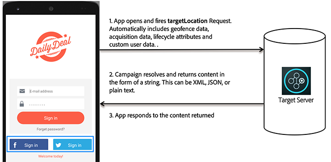

# How Target works in mobile apps

The Adobe Mobile SDK contacts the Target server to get the content along with other data points to show the right experience to the user.

## Target Locations and Success Metrics

A *target location* is also referred to as an mbox. An identified location in the app is enabled for testing or personalization (for example, the welcome message on the home screen). These locations are identified during the test creation process.

A *[success metric](https://experienceleague.adobe.com/docs/target/using/activities/success-metrics/success-metrics.html)* is an action performed by the user that identifies if a specific activity was successful (such as signing up, making a purchase, booking a ticket, and so on).

* **Target Location:** The content that shows below the register button.

  This particular user is offered free shipping until 6 PM. This location can be reused across multiple Target activities to run A/B tests and personalization. 

* **Success Metric:** The action performed by the user where the user taps the register button.

**Understand How Target Works in the SDK**

