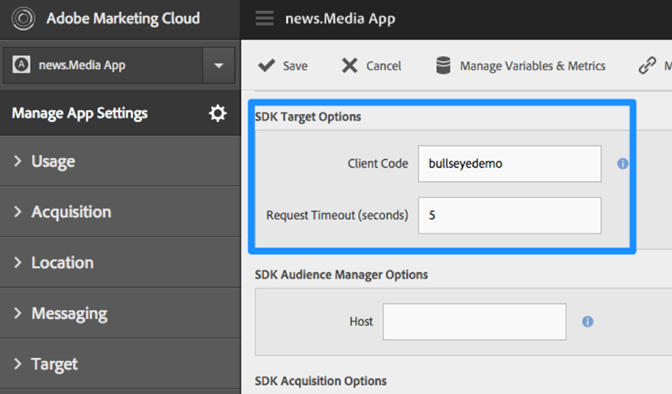
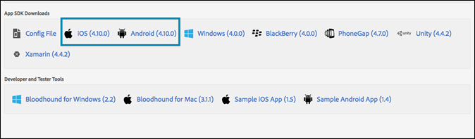

---
keywords:
- mobile app
- mobile app sdk
- target mobile app
- mobile target sdk
- mobile app sdk
- enable target in sdk
description: Learn how to add the Adobe Mobile Services SDK to your mobile app.
title: How Do I Enable Target in the Adobe Mobile SDK?
feature: Implement Mobile
role: Developer
exl-id: c34bd50c-e17f-4dfb-8470-8f4c8639ee9f
---
# Enable Target in the SDK

Add the Adobe Mobile Services SDK to your app.

1. If you haven't installed the Adobe Mobile Services SDK in your app, use your Analytics or Experience Cloud credentials and download the SDK from the [Adobe Mobile Services](https://mobilemarketing.adobe.com/) website.

1. Add the Adobe Mobile Services SDK to your app.

   You can find the instructions under [Core Implementation and Lifecycle](https://experienceleague.adobe.com/docs/mobile-services/ios/getting-started-ios/dev-qs.html). 

1. Add client code, timeout and enable SSL.

   In the Experience Cloud, open Mobile Services, then go to **Manage App Settings** > **SDK Target Options**.

   Add your Target clientcode and timeout. The clientcode is unique to your account or company. The timeout is the time in number of seconds until which Target will wait for a response before showing the default content. Make sure the **Use HTTPS** option is checked in the Manage App Settings page in Adobe Mobile Services. If HTTPS isn't enabled, all calls in iOS9+ will be blocked unless you allowlist the Target server.

   

1. After you’ve created/located your app, find the app settings and download the desired SDK.

   

<InlineAlert variant="warning" slots="text"/>

 If you don't have access to the mobile marketing interface, you can make changes directly in the config file in your app code; however, it won't be in sync with the settings page in the user interface.
