---
keywords:
- qa
- preview
- preview link
- mobile
- mobile preview
description: Use mobile preview links to perform end-to-end QA for mobile app activities. You can enroll yourself into different experiences without special test devices.
title: How Do I Use the Mobile Preview Link in Target Mobile?
feature: Implement Mobile
role: Developer
exl-id: c66325b3-3995-401e-a1e3-839fdb1cf762
---
# Target mobile preview

Use the mobile preview link to perform easy end-to-end QA for mobile app activities and enroll yourself into different experiences right on your device without any special test devices.

<InlineAlert variant="info" slots="text"/>

The mobile preview feature requires that you download and install the appropriate 4.14 (or later) version of the Adobe Mobile SDK.

## Overview

The mobile preview functionality lets you fully test your Mobile app activities prior to launching them live.

## Prerequisites

1. **Use a supported version of the SDK:** The mobile preview feature requires that you download and install the appropriate 4.14 (or later) version of Adobe Mobile SDK in your corresponding apps.

   For instructions to download the appropriate SDK, see:

    * **iOS:** [Before You start](https://experienceleague.adobe.com/docs/mobile-services/ios/getting-started-ios/requirements.html) in the *Mobile Services iOS Help*. 
    * **Android:** [Before You start](https://experienceleague.adobe.com/docs/mobile-services/android/getting-started-android/requirements.html) in the *Mobile Services Android Help*.

1. **Set up a URL scheme:** The preview link uses a URL scheme to open your app. You must specify a unique URL scheme for the preview.

   The following illustration is an example on iOS:

   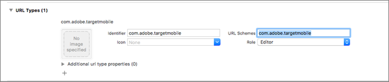

   The following illustration is an example on Android:

   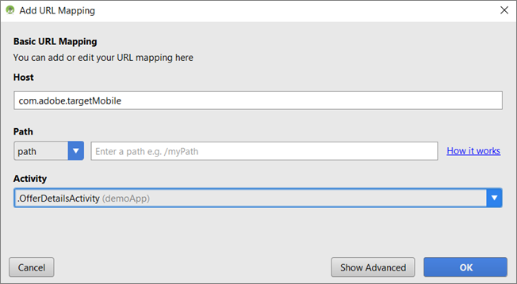

1. **Track Adobe DeepLink**

   **iOS:** In the app delegate, call `[ADBMobile trackAdobeDeepLink:url` when the delegate is asked to open the resource with the URL scheme that was specified in the previous step.

   The following code snippet is an example:

   ```javascript
   - (BOOL) application:(UIApplication *)app openURL:(NSURL *)url 
                options:(NSDictionary<NSString *,id> *)options { 
    
       if ([[url scheme] isEqualToString:@"com.adobe.targetmobile"]) { 
           [ADBMobile trackAdobeDeepLink:url]; 
           return YES; 
       } 
       return NO; 
   } 
   
   ```

   **Android:** In the app , call `Config.trackAdobeDeepLink(URL);` when the caller is asked to open the resource with the URL scheme that was specified in the previous step.

   ```javascript
    private Boolean shouldOpenDeeplinkUrl() { 
        Intent appLinkIntent = getIntent(); 
        String appLinkAction = appLinkIntent.getAction(); 
        Uri appLinkData = appLinkIntent.getData; 
        if (appLinkData.toString().startsWith("com.adobe.targetmobile")) { 
            Config.trackAdobeDeepLink(appLinkData); 
            return true; 
        } 
        return false; 
     }
   ```

   To make Mobile Preview work for Android, you must also add the following code snippet in AndroidManifest.xml if using version 5 of the Adobe Mobile SDK:

   ```javascript
   <activity android:name="com.adobe.marketing.mobile.FullscreenMessageActivity" />
   ```

   If you are using version 4 of the Adobe Mobile SDK, use the following code snippet:

   ```javascript
   <activity android:name="com.adobe.mobile.MessageFullScreenActivity" />
   ```

## Generating a Preview Link

1. In the Target UI, click the **More Options** icon (three vertical ellipses), then select **Create Mobile Preview**.

   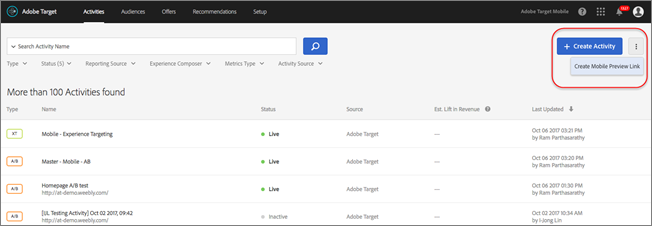

2. Select the activities that you want to preview, then click **Generate Mobile Preview Link**.

<InlineAlert variant="info" slots="text"/>

Only form-based AB and XT activities can be selected.

   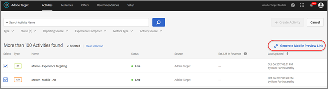

3. Specify your app's URL scheme.

   This needs to be the same as what is present in your iOS or Android app. Repeat this process separately for iOS and Android, if required.

   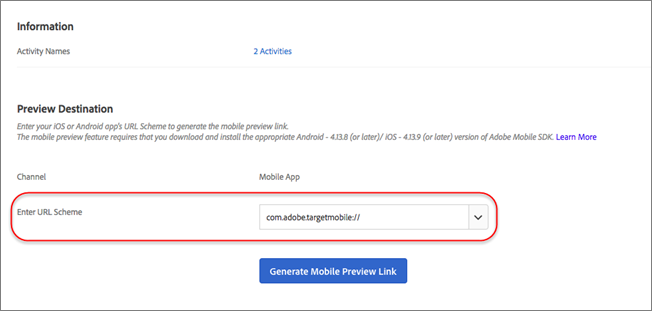

4. Click **Generate Mobile Preview Link**, then copy the link.

   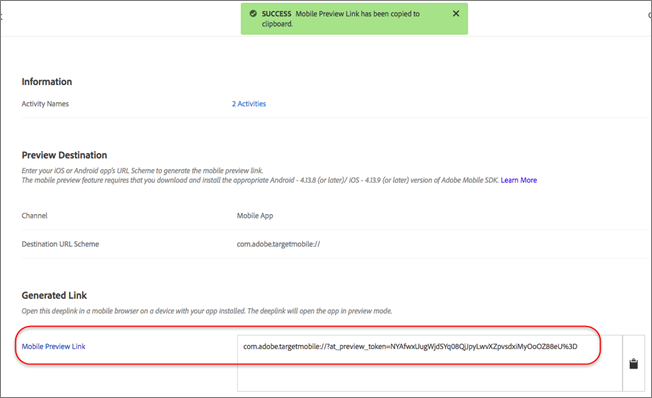

## Preview on Your Device

Open the link in a mobile browser on a device where you have your app installed. This app can be the production app that you downloaded from the Apple App store or the Google Play store. It doesn't have to be a special build. If you have an active preview link, you will be able to view the experiences on device.

1. Open the link in your mobile browser.

    Share the link that you copied in the previous step from the Target UI to your mobile device in a convenient way, for example using text, email, or Slack.

    |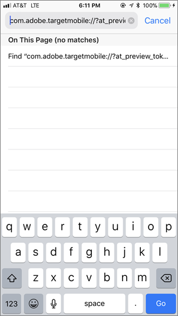|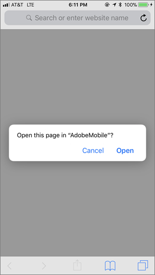|

    Your app opens and starts the Target Mobile Preview Mode. 

1. Select the combination of experiences that you want to see, then click **Launch Experiences**.

   |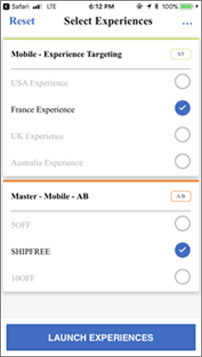|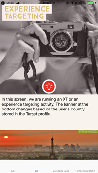|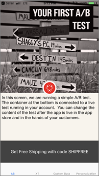|
   |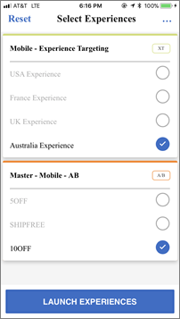|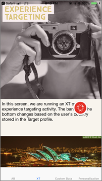|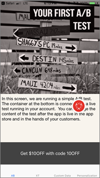|

## Limitations

* The view must load again for the new content to display after the **Launch Experiences** button is clicked. The easiest way is to switch to a different screen and then come back to the screen where you are expecting the change to happen. 
* Mobile preview is not supported for Android versions earlier than API-19 (KitKat).
