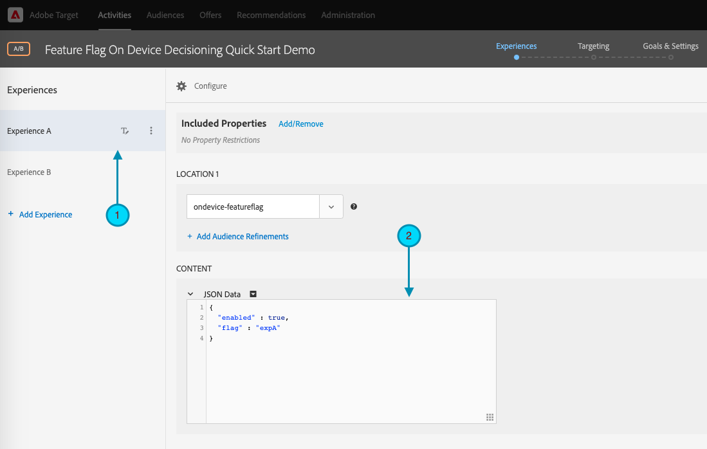

# Getting Started with Target SDKs

In order to get up and running, we encourage you to create your first [on-device decisioning](../on-device-decisioning/index.md) feature flag activity in the language of your choice:

* Node.js
* Java
* .NET
* Python
  
## Summary of steps

1. Enable On-Device Decisioning for your organization
1. Install the SDK
1. Initialize the SDK
1. Set up the feature flags in an Adobe Target A/B Test
1. Implement and render the feature in your application
1. Implement tracking for events in your application
1. Activate your A/B activity

## 1. Enable On-Device Decisioning for your organization

Enabling on-device decisioning ensures an A/B activity is executed at near-zero latency. To enable this feature, navigate to **Administration** > **Implementation** > **Account details** and enable the **On-Device Decisioning** toggle.

   

<InlineAlert variant="info" slots="text"/>

You must have the **Admin** or **Approver** [user role](https://experienceleague.adobe.com/docs/target/using/administer/manage-users/user-management.html) to enable or disable the **On-Device Decisioning** toggle.

After enabling the **On-Device Decisioning** toggle, Adobe Target begins generating [rule artifacts](../on-device-decisioning/rule-artifact-overview.md) for your client.

## 2. Install the SDK

For Node.js, Java, and Python, run the following command in your project directory in the terminal. For .NET, add it as a dependency by [installing from NuGet](https://www.nuget.org/packages/Adobe.Target.Client).

<CodeBlock slots="heading, code" repeat="4" languages="js, java, bash, python" />

#### Node.js (NPM)

```js
npm i @adobe/target-nodejs-sdk -P
```

#### Java (Maven)

```javascript
<dependency>
   <groupId>com.adobe.target</groupId>
   <artifactId>java-sdk</artifactId>
   <version>2.0</version>
</dependency>
```

#### .NET (Bash)

```bash
dotnet add package Adobe.Target.Client
```

#### Python (pip)

```python
pip install target-python-sdk
```

<InlineAlert variant="info" slots="text"/>

The rule artifact is downloaded during the SDK initialization step. You can customize the initialization step to determine how the artifact is downloaded and used.

<CodeBlock slots="heading, code" repeat="4" languages="js, java, bash, python" />

#### Node.js

```js
const TargetClient = require("@adobe/target-nodejs-sdk");

const CONFIG = {
   client: "<your target client code>",
   organizationId: "your EC org id",
   decisioningMethod: "on-device",
   events: {
      clientReady: targetClientReady
      }
};

const tClient = TargetClient.create(CONFIG);

function targetClientReady() {
   //Adobe Target SDK has now downloaded the JSON artifact locally, which contains the activity details.
   //We will see how to use the artifact here very soon.
}
```

#### Java (Maven)

```javascript
ClientConfig config = ClientConfig.builder()
   .client("testClient")
   .organizationId("ABCDEF012345677890ABCDEF0@AdobeOrg")
   .build();
TargetClient targetClient = TargetClient.create(config);
```

#### .NET (C#)

```csharp
var targetClientConfig = new TargetClientConfig.Builder("testClient", "ABCDEF012345677890ABCDEF0@AdobeOrg")
   .Build();
this.targetClient.Initialize(targetClientConfig);
```

#### Python

```python
from target_python_sdk import TargetClient

def target_client_ready():
   # Adobe Target SDK has now downloaded the JSON artifact locally, which contains the activity details.
   # We will see how to use the artifact here very soon.

CONFIG = {
   "client": "<your target client code>",
   "organization_id": "your EC org id",
   "decisioning_method": "on-device",
   "events": {
      "client_ready": target_client_ready
   }
}

target_client = TargetClient.create(CONFIG)
```

## 4. Set up the feature flags in an Adobe Target A/B Test

1. In Adobe Target, navigate to the **Activities** page, then select **Create Activity** > **A/B test**. 

   

2. In the **Create A/B Test Activity** modal, leave the default Web option selected (1), select **Form** as your experience composer (2), select **Default Workspace** with **No Property Restrictions**(3), then click **Next** (4).

   

3. In the **Experiences** step of activity creation, provide a name for your activity (1) and add a second experience, Experience B, by clicking **Add Experience** (2). Enter the location name of your choice (3). For example, `ondevice-featureflag` or `homepage-addtocart-featureflag` are location names indicating the destinations for feature flag testing.  In the example shown below, `ondevice-featureflag` is the location defined for Experience B. Optionally, you may add Audience Refinements (4) to restrict qualification to the activity.

   

4. In the **CONTENT** section on the same page, select **Create JSON Offer** in the drop-down (1) as shown.


   

5. In the **JSON Data** text box that appears, type your feature flag variables for each experience (1), using a valid JSON object (2).

   Enter the feature flag variables for Experience A.

   

   <CodeBlock slots="heading, code" repeat="1" languages="JSON" />
   
   #### (Sample JSON for Experience A, above)

   ```json
   {
      "enabled" : true,
      "flag" : "expA"
   }
   ```

   Enter the feature flag variables for Experience B.

   

   <CodeBlock slots="heading, code" repeat="1" languages="JSON" />
   
   #### (Sample JSON for Experience B, above)

   ```json
   {
      "enabled" : true,
      "flag" : "expB"
   }
   ```

1. Click **Next** (1) to advance to the **Targeting** step of activity creation.

   

2. In the **Targeting** step example shown below, Audience Targeting (2) remains on the default set of All Visitors, for simplicity. This means the activity is untargeted. However, note Adobe recommends you always target your audiences for production activities. Click **Next** (3) to advance to the **Goals & Settings** step of activity creation.

   

3. In the **Goals & Settings** step, set **Reporting Source** to **Adobe Target** (1). Define the **Goal Metric** as **Conversion**, specifying the details based on your site's conversion metrics (2). Click **Save & Close** (3) to save the activity.

   

## 5. Implement and render the feature in your application

After setting up the feature flag variables in Adobe Target, modify your application code to use them. For example, after getting the feature flag in the application, you can use it to enable features and render the experience for which the visitor qualified.

<CodeBlock slots="heading, code" repeat="4" languages="js, java, bash, python" />

#### Node.js

```js
//... Code removed for brevity
​
let featureFlags = {};
​
function targetClientReady() {
   tClient.getAttributes(["ondevice-featureflag"]).then(function(response) {
      const featureFlags = response.asObject("ondevice-featureflag");
      if(featureFlags.enabled && featureFlags.flag !== "expA") { //Assuming "expA" is control
         console.log("Render alternate experience" + featureFlags.flag);
      }
      else {
         console.log("Render default experience");
      }
   });
}
```

#### Java (Maven)

```javascript
MboxRequest mbox = new MboxRequest().name("ondevice-featureflag").index(0);
TargetDeliveryRequest request = TargetDeliveryRequest.builder()
   .context(new Context().channel(ChannelType.WEB))
   .execute(new ExecuteRequest().mboxes(Arrays.asList(mbox)))
   .build();
Attributes attributes = targetClient.getAttributes(request, "ondevice-featureflag");
String flag = attributes.getString("ondevice-featureflag", "flag");
```

#### .NET (C#)

```csharp
var mbox = new MboxRequest(index: 0, name: "ondevice-featureflag");
var deliveryRequest = new TargetDeliveryRequest.Builder()
   .SetContext(new Context(ChannelType.Web))
   .SetExecute(new ExecuteRequest(mboxes: new List<MboxRequest> { mbox }))
   .Build();
var attributes = targetClient.GetAttributes(request, "ondevice-featureflag");
var flag = attributes.GetString("ondevice-featureflag", "flag");
```

#### Python

```python
# ... Code removed for brevity

feature_flags = {}

def target_client_ready():
   attribute_provider = target_client.get_attributes(["ondevice-featureflag"])
   feature_flags = attribute_provider.as_object(mbox_name="ondevice-featureflag")
   if feature_flags.get("enabled") and feature_flags.get("flag") != "expA": # Assuming "expA" is control
      print("Render alternate experience {}".format(feature_flags.get("flag")))
   else:
      print("Render default experience")
```

## 6. Implement additional tracking for events in your application

Optionally, you may send additional events for tracking conversions using the sendNotification() function.

<CodeBlock slots="heading, code" repeat="4" languages="js, java, bash, python" />

#### Node.js

```js
//... Code removed for brevity
​
//When a conversion happens
TargetClient.sendNotifications({
   targetCookie,
   "request" : {
      "notifications" : [
      {
         type: "display",
         timestamp : Date.now(),
         id: "conversion",
         mbox : {
            name : "orderConfirm"
         },
         order : {
            id: "BR9389",
            total : 98.93,
            purchasedProductIds : ["J9393", "3DJJ3"]
         }
      }
      ]
   }
})
```

#### Java (Maven)

```javascript
Notification notification = new Notification();
notification.setId("conversion");
notification.setImpressionId(UUID.randomUUID().toString());
notification.setType(MetricType.DISPLAY);
notification.setTimestamp(System.currentTimeMillis());
Order order = new Order("BR9389");
order.total(98.93);
order.purchasedProductIds(["J9393", "3DJJ3"]);
notification.setOrder(order);

TargetDeliveryRequest notificationRequest =
   TargetDeliveryRequest.builder()
      .context(new Context().channel(ChannelType.WEB))
      .notifications(Collections.singletonList(notification))
      .build();

NotificationDeliveryService notificationDeliveryService = new NotificationDeliveryService();
notificationDeliveryService.sendNotification(notificationRequest);
```

#### .NET (C#)

```csharp
var order = new Order
{
   Id = "BR9389",
   Total = 98.93M,
   PurchasedProductIds = new List<string> { "J9393", "3DJJ3" },
};
​
var notification = new Notification
{
   Id = "conversion",
   ImpressionId = Guid.NewGuid().ToString(),
   Type = MetricType.Display,
   Timestamp = DateTimeOffset.UtcNow.ToUnixTimeMilliseconds(),
   Order = order,
};
​
var notificationRequest = new TargetDeliveryRequest.Builder()
   .SetContext(new Context(ChannelType.Web))
   .SetNotifications(new List<Notification> {notification})
   .Build();
​
targetClient.SendNotifications(notificationRequest);
```

#### Python

```python
# ... Code removed for brevity

# When a conversion happens
notification_mbox = NotificationMbox(name="orderConfirm")
order = Order(id="BR9389, total=98.93, purchased_product_ids=["J9393", "3DJJ3"])
notification = Notification(
   id="conversion",
   type=MetricType.DISPLAY,
   timestamp=1621530726000,  # Epoch time in milliseconds
   mbox=notification_mbox,
   order=order
)
notification_request = DeliveryRequest(notifications=[notification])


target_client.send_notifications({
   "target_cookie": target_cookie,
   "request" : notification_request
})
```

## 7. Activate your A/B activity

1. Click **Activate** (1) to activate your A/B activity.

<InlineAlert variant="info" slots="text"/>

You must have the **Approver** or **Publisher** [user role](https://experienceleague.adobe.com/docs/target/using/administer/manage-users/user-management.html) to perform this step.

