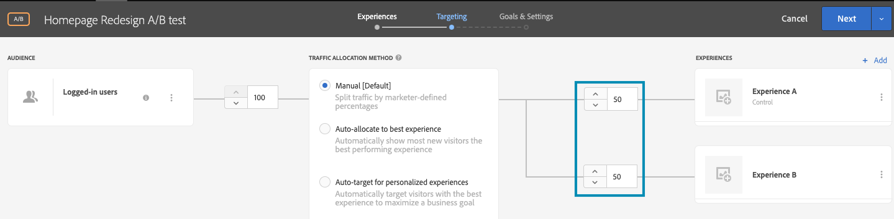

# Execute A/B tests with feature flags

## Summary of steps

1. Enable On-Device Decisioning for your organization
1. Create an A/B activity
1. Define your A and B
1. Add an audience
1. Set traffic allocation
1. Set traffic distribution to variations
1. Set up reporting
1. Add metrics for tracking KPIs
1. Implement code to execute A/B tests with feature flags
1. Activate your A/B test with feature flags

**NOTE**: Suppose you want to determine whether your fall-themed redesign of your homepage would be received well by your users. You decide to test it by running an A/B experiment in Adobe Target. You also want to make sure the experiment is delivered with great performance so that a negative or slow user experience does not skew the results.

## Enable On-Device Decisioning for your organization

Enabling on-device decisioning ensures an A/B activity is executed at near-zero latency. To enable this feature, navigate to **Administration** > **Implementation** > **Account details** in Adobe Target, and enable the **On-Device Decisioning** toggle.

<!--- Insert image-odd4.png --->


**NOTE**: You must have the Admin or Approver [user role](https://experienceleague.adobe.com/docs/target/using/administer/manage-users/user-management.html) to enable or disable the On-Device Decisioning toggle.

After enabling the **On-Device Decisioning** toggle, Adobe Target begins generating rule artifacts for your client.

## Create an A/B activity

In Adobe Target, navigate to the **Activities** page, then select **Create Activity** > **A/B test**.


In the **Create A/B Test Activity** modal, leave the default **Web** option selected (1), select **Form** as your experience composer (2), select **Default Workspace** with No **Property Restrictions** (3), and click **Next** (4).


## Define your A and B

1. In the **Experiences** step of activity creation, provide a name for your activity (1) and add a second experience, Experience B, by clicking the **Add Experience** (2) button. Enter the name of the location (3) within your application where you want to execute your A/B test. In the example shown below, homepage is the location defined for Experience A. (It is also the location defined for Experience B.) 

   Experience A defines the control, which is the current homepage design.

   

   Experience B defines the challenger, which will represent a redesigned homepage. Click to change default content (1).

   

1. In Experience B, click to change the content from **Default Content** to the redesigned content by selecting **Create JSON Offer** as shown below (1).

   

1. Define the JSON with attributes that will be utilized as flags to enable your business logic to render the newly redesigned homepage, rather than the current homepage in production.


   **NOTE**: When Adobe Target buckets a user to see Experience B (the redesigned homepage), the JSON with the attributes defined in the example will be returned. In your code, you will need to check the attribute values to decide whether to execute the business logic to render the redesigned homepage. You get to define the names, values, and number of attributes in this JSON response.

   

## Add an audience

Suppose you want to first test the redesign on your loyal customers, whom you can identify based on whether or not they are logged in.

1. In the **Targeting** step, click to replace the **All Visitors** audience, as shown.

   

1. In the **Create Audience** modal, define a custom rule where `logged-in = true`. This defines the group of users who are logged in. Use this audience in your activity.

   

## Set traffic allocation

Define the percentage of your logged-in users against which you want to test your new homepage redesign. In other words, to what percentage of your users do you want to roll out this test? In this example, to deploy this test to all logged-in users, keep the traffic allocation at 100%.


## Set traffic distribution to variations

Define the percentage of your logged-in users that will see the current design of the homepage or the completely new redesign. In this example, keep the traffic distribution as a 50/50 split between Experiences A and B.



## Set up reporting

In the **Goals & Settings** step, choose **Adobe Target** as the **Reporting Source** to view activity results in the Adobe Target UI, or choose **Adobe Analytics** to view them in the Adobe Analytics UI.


## Add metrics for tracking KPIs

Choose a **Goal Metric** to measure the A/B test. In this example, a successful conversion is based on whether the user reaches the bottom of the page, indicating engagement. Therefore, **Conversion** is determined based on whether the user viewed the location named bottom-of-the-page.

## Implement code to execute A/B tests with feature flags into your application

**Node.js**

```
const TargetClient = require("@adobe/target-nodejs-sdk");
const options = {
  client: "testClient",
  organizationId: "ABCDEF012345677890ABCDEF0@AdobeOrg",
  decisioningMethod: "on-device",
  events: {
    clientReady: targetClientReady
  }
};
const targetClient = TargetClient.create(options);

function targetClientReady() {
  return targetClient.getAttributes(["homepage"]).then(function(attributes) {
    const flag = attributes.getValue("homepage", "feature-flag");
    // ...
  });
}
```

**Java**

```
import com.adobe.target.edge.client.ClientConfig;
import com.adobe.target.edge.client.TargetClient;
import com.adobe.target.delivery.v1.model.ChannelType;
import com.adobe.target.delivery.v1.model.Context;
import com.adobe.target.delivery.v1.model.ExecuteRequest;
import com.adobe.target.delivery.v1.model.MboxRequest;
import com.adobe.target.edge.client.entities.TargetDeliveryRequest;
import com.adobe.target.edge.client.model.TargetDeliveryResponse;

ClientConfig config = ClientConfig.builder()
    .client("testClient")
    .organizationId("ABCDEF012345677890ABCDEF0@AdobeOrg")
    .build();
TargetClient targetClient = TargetClient.create(config);
MboxRequest mbox = new MboxRequest().name("homepage").index(0);
TargetDeliveryRequest request = TargetDeliveryRequest.builder()
    .context(new Context().channel(ChannelType.WEB))
    .execute(new ExecuteRequest().mboxes(Arrays.asList(mbox)))
    .build();
Attributes attributes = targetClient.getAttributes(request, "homepage");
String flag = attributes.getString("homepage", "feature-flag");
```

## Activate your A/B test with feature flag

