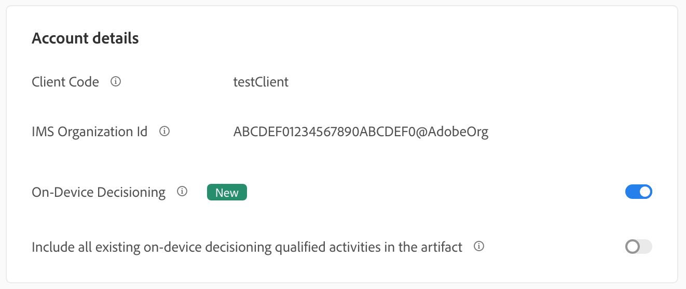

# Getting Started with Target SDKs

In order to get up and running, we encourage you to create your first [on-device decisioning](../../sdk-guides/on-device-decisioning/index.md) feature flag activity in the language of your choice:

* Node.js
* Java
* .NET
* Python
  
## Summary of steps

1. Enable On-Device Decisioning for your organization
1. Install the SDK
1. Initialize the SDK
1. Set up the feature flags in an Adobe Target A/B Test
1. Implement and render the feature in your application
1. Implement tracking for events in your application
1. Activate your A/B activity

## 1. Enable On-Device Decisioning for your organization

Enabling on-device decisioning ensures an A/B activity is executed at near-zero latency. To enable this feature, navigate to **Administration** > **Implementation** > **Account details** and enable the **On-Device Decisioning** toggle.

   

<InlineAlert variant="info" slots="text"/>

You must have the **Admin** or **Approver** [user role](https://experienceleague.adobe.com/docs/target/using/administer/manage-users/user-management.html) to enable or disable the **On-Device Decisioning** toggle.

After enabling the **On-Device Decisioning** toggle, Adobe Target begins generating [rule artifacts](../on-device-decisioning/rule-artifact-overview.md) for your client.

## 2. Install the SDK

For Node.js, Java, and Python, run the following command in your project directory in the terminal. For .NET, add it as a dependency by [installing from NuGet](https://www.nuget.org/packages/Adobe.Target.Client).

<CodeBlock slots="heading, code" repeat="4" languages="js, java, bash, python" />

#### Node.js

```js
npm i @adobe/target-nodejs-sdk -P
```

#### Java (Maven)

```java
<dependency>
   <groupId>com.adobe.target</groupId>
   <artifactId>java-sdk</artifactId>
   <version>2.0</version>
</dependency>
```

#### .NET (Bash)

```bash
dotnet add package Adobe.Target.Client
```

#### Python (pip)

```python
pip install target-python-sdk
```
